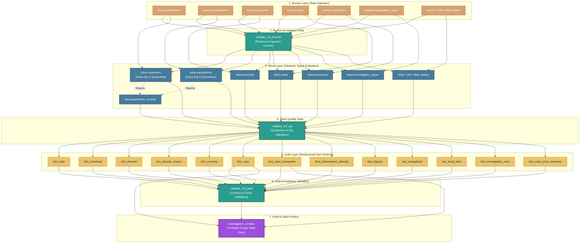

# Data Pipeline Architecture & Implementation Specification

> **Confluence Document Details**  
> **Space**: Engineering & Data Architecture  
> **Document Title**: Medallion Data Pipeline & AI-Ready Context Implementation  
> **Target Environment**: Databricks (Free Edition / Enterprise)  
> **Supported Catalogs**: `g3_dev` | `g3_test` | `g3_catalog`  
> **Frameworks**: Databricks Auto Loader, PySpark, Delta Lake, Unity Catalog  
> **Last Updated**: 2026-07-28  

---

## 1. End-to-End Lineage (Mermaid Diagram)



---

## 2. Medallion Data Architecture Overview

The transaction investigation data pipeline follows the **Medallion Architecture** pattern (Bronze → Silver → Gold) augmented with explicit Quality Gates and Data Governance layers:

| Layer / Schema | Purpose & Responsibilities | Key Controls & Metadata |
|---|---|---|
| **Bronze** (`<catalog>.bronze`) | Raw data ingestion from source CSV files into append-only Delta tables. Preserves source schema and original data structure. | System metadata appended: `_source_file`, `_ingest_ts`, `_run_id`, `_batch_id`, `_rescued_data`. Schema evolution supported. |
| **Governance** (`<catalog>.gov`) | Centralized management of Data Quality rules, masking policies, and column-level metadata lineage. | Tables: `dq_rules`, `masking_policies`, `metadata_lineage`. |
| **Silver** (`<catalog>.silver`) | Cleaned, conformed, type-casted, and PII-masked data layer. Isolates data quality defects into quarantine. | Inline DQ evaluation, type casting via `type_cast.py`, snapshot deduplication, and quarantine isolation into `silver.quarantine_records`. |
| **Gold** (`<catalog>.gold`) | Star-schema dimensional data warehouse (`dim_*` and `fact_*`) optimized for analytical queries. | Natural grain enforcement, referential integrity checks, business logic transformations. |
| **AI Data Product** (`<catalog>.gold.investigation_context`) | Single-table, curated, PII-safe investigation context view for AI retrieval. | Flagged `ai_allowed: true`. Contains quality status, warnings, source lineage, and masked attributes. |

---

## 3. Pipeline Implementation

The end-to-end data pipeline is structured into 8 modular, sequential implementation stages executed across Databricks PySpark and Delta Lake:

```
[1. Ingest Mock Source Data]  --> [2. Store Raw Data]  --> [3. Validate Schema & Data Quality]
                                                                    |
                                                                    v
[6. Apply Masking / Redaction] <-- [5. Transform Valid Records] <-- [4. Quarantine Failed Records]
         |
         v
[7. Create Curated AI-Ready Context] --> [8. Write Metadata & Lineage Output]
```

### 3.1. Ingest Mock Source Data

- **Module Source**: [`generate_mock_databricks.py`](file:///home/duckthihn/Assignment-G3/generate_mock_databricks.py) calling [`mock/generate.py`](file:///home/duckthihn/Assignment-G3/mock/generate.py)
- **Mechanism**:
  - Executes Python Faker-based mock generation directly inside the Databricks environment.
  - Supports configurable widgets: `catalog` (`g3_dev`, `g3_test`, `g3_catalog`), `transactions` (default `200,000` rows, baseline `2,000,000` rows), `seed` (`42`), `defect_rate` (`0.05`), and `scd_rate` (`0.02`).
  - Implements safe multi-batch ingestion: outputs are generated into private staging paths (`_staging/`) and published atomically to avoid reading partial or incomplete files.
  - Generates realistic banking domain datasets across 27 tables including `customers`, `accounts`, `transactions`, `cards`, `merchants`, `disputes`, `chargebacks`, `fraud_alerts`, `investigation_cases`, `investigation_notes`, `defects_manifest`, and `scd_changes_manifest`.

### 3.2. Store Raw Data

- **Module Source**: [`pipeline/bronze/autoloader_common.py`](file:///home/duckthihn/Assignment-G3/pipeline/bronze/autoloader_common.py), [`pipeline/bronze/schema_evolution.py`](file:///home/duckthihn/Assignment-G3/pipeline/bronze/schema_evolution.py), and `pipeline/bronze/bronze_all_tables.py`
- **Mechanism**:
  - **Storage Volume**: Source CSVs are published to Unity Catalog Volumes under `/Volumes/<catalog>/bronze/raw_data/<table>/`.
  - **Auto Loader Ingestion**: Uses Databricks Auto Loader (`spark.readStream` with format `cloudFiles`) to incrementally ingest raw CSV files into Delta tables in `<catalog>.bronze.*`.
  - **Audit Metadata Enrichment**: Automatically appends system audit columns to every raw record:
    - `_source_file`: Original file path and filename.
    - `_source_file_mod_time`: Source file modification timestamp.
    - `_ingest_ts`: UTC ingestion timestamp.
    - `_run_id`: Unique execution run identifier.
    - `_batch_id`: Ingested file batch sequence number.
    - `_source_record_id`: Synthetic deterministic record index.
    - `_record_hash`: SHA256 payload content fingerprint.
    - `_rescued_data`: Auto Loader rescued column for unparsed or extra raw fields.
  - **Schema Evolution**: Automatically tracks header changes and schema drift without breaking ingestion streams.

### 3.3. Validate Schema and Data Quality

- **Module Source**: [`pipeline/validation/validate_m1_bronze.py`](file:///home/duckthihn/Assignment-G3/pipeline/validation/validate_m1_bronze.py), [`pipeline/dq/dq_02_load_dq_rules.py`](file:///home/duckthihn/Assignment-G3/pipeline/dq/dq_02_load_dq_rules.py), and [`pipeline/dq/dq_03_failures_all_rules.py`](file:///home/duckthihn/Assignment-G3/pipeline/dq/dq_03_failures_all_rules.py)
- **Mechanism**:
  - **M1 Schema Validation**: Validates existence of Bronze tables, required contract columns, audit metadata, and non-empty file ingestion.
  - **Governance Rule Registry**: Maintains 35 central Data Quality rules in `<catalog>.gov.dq_rules`, covering:
    - *Null / Mandatory Checks*: Missing primary keys, mandatory customer attributes, account references.
    - *Format & Pattern Validation*: Invalid email strings, phone number syntax, date formats.
    - *Referential Integrity & Domain Checks*: Invalid status codes, currency codes, negative amounts, future event dates.
  - **Multi-Rule Evaluation**: Evaluates Bronze snapshots against all 35 active rules using SQL expressions and PySpark set logic in `dq_03_failures_all_rules.py`.

### 3.4. Quarantine Failed Records

- **Module Source**: [`pipeline/dq/dq_03_failures_all_rules.py`](file:///home/duckthihn/Assignment-G3/pipeline/dq/dq_03_failures_all_rules.py) and [`pipeline/silver/snapshot.py`](file:///home/duckthihn/Assignment-G3/pipeline/silver/snapshot.py)
- **Mechanism**:
  - Isolates invalid, corrupted, or rule-violating records into a dedicated Delta table: `<catalog>.silver.quarantine_records`.
  - **Quarantine Record Schema**:
    - `run_id`: Pipeline execution run identifier.
    - `source_table`: Origin table name (e.g. `customers`, `transactions`).
    - `source_record_id`: Source record identifier.
    - `record_key`: Business key value.
    - `rule_id` & `rule_name`: Violated Data Quality rule code and title (e.g. `DQ-CUST-EMAIL-FMT`).
    - `failure_reason`: Human-readable error description.
    - `severity`: Error severity level (`CRITICAL`, `MAJOR`, `MINOR`).
    - `disposition`: Action taken (`reject` - quarantined and excluded from Silver; `warn`/`flag` - allowed with warning flag).
    - `raw_record`: Complete JSON string of the failed row for forensic auditing.
    - `detected_at`: Detection timestamp.
  - Ensures clean separation: Silver processing excludes all rows marked with `disposition = 'reject'` via `exclude_dq_quarantined_rows()`.

### 3.5. Transform Valid Records

- **Module Source**: [`pipeline/silver/silver_all_tables.py`](file:///home/duckthihn/Assignment-G3/pipeline/silver/silver_all_tables.py), [`pipeline/silver/type_cast.py`](file:///home/duckthihn/Assignment-G3/pipeline/silver/type_cast.py), [`pipeline/gold/gold_models.py`](file:///home/duckthihn/Assignment-G3/pipeline/gold/gold_models.py), and [`pipeline/gold/gold_common.py`](file:///home/duckthihn/Assignment-G3/pipeline/gold/gold_common.py)
- **Mechanism**:
  - **Silver Cleaning & Conformance**:
    - Reads latest Bronze snapshot using `latest_batch_snapshot()`.
    - Filters out quarantined records (`exclude_dq_quarantined_rows`).
    - Applies strict data type casting (`DATE`, `TIMESTAMP`, `DECIMAL`, `INTEGER`) with error trap handling using `type_cast.py`.
    - Deduplicates records to enforce latest business snapshot state.
  - **Gold Star-Schema Modeling**:
    - Transforms clean Silver tables into an enterprise dimensional warehouse star schema:
    - **6 Dimensions**: `dim_date`, `dim_merchant`, `dim_channel`, `dim_dispute_reason`, `dim_currency`, `dim_case`.
    - **7 Fact Tables**: `fact_case_transaction`, `fact_authorization_attempt`, `fact_dispute`, `fact_chargeback`, `fact_fraud_alert`, `fact_investigation_note`, `fact_case_party_summary`.
    - Enforces natural primary key grains and foreign key referential integrity.

### 3.6. Apply Masking or Redaction

- **Module Source**: [`pipeline/silver/silver_masking_policies.py`](file:///home/duckthihn/Assignment-G3/pipeline/silver/silver_masking_policies.py), [`pipeline/silver/silver_customers.py`](file:///home/duckthihn/Assignment-G3/pipeline/silver/silver_customers.py), and [`pipeline/silver/silver_cards.py`](file:///home/duckthihn/Assignment-G3/pipeline/silver/silver_cards.py)
- **Mechanism**:
  - Governance policies are registered in `<catalog>.gov.masking_policies`.
  - Implements targeted PII protection techniques prior to writing Silver/Gold outputs:
    - **Tokenization (FPE / HMAC-SHA256)**: Applied to `first_name` and `last_name` to preserve data utility while masking identity.
    - **Partial Masking**:
      - `email`: Preserves first character and domain (e.g. `j***@***.com`).
      - `phone`: Retains only last 4 digits (e.g. `******1234`).
      - `pan` (Primary Account Number): Masks all but last 4 digits (e.g. `XXXX-XXXX-XXXX-1234`).
    - **Salted Hashing (SHA256)**: Applied to `address`, `tax_id`, and employee `full_name`.
    - **Generalization**: Date of birth (`dob`) is generalized into age bands based on current run date.
    - **Text Redaction & Screening**: Free-form text in `investigation_notes` is screened to scrub sensitive personal data, phone numbers, and SSN/Tax IDs before exposure.

### 3.7. Create Curated AI-Ready Context

- **Module Source**: [`pipeline/gold/gold_models.py`](file:///home/duckthihn/Assignment-G3/pipeline/gold/gold_models.py) (Model: `investigation_context`) and [`deliverables/ai-ready-context-output.md`](file:///home/duckthihn/Assignment-G3/deliverables/ai-ready-context-output.md)
- **Mechanism**:
  - Builds a single-table, curated, deterministic AI data product view: `<catalog>.gold.investigation_context`.
  - Consolidates all case investigation details into one AI-optimised record per eligible `case_id`:
    - Case metadata (priority, status, fraud type code, open/close timestamps).
    - Objective, deterministic case summary (avoids subjective bias or unverified guilt inferences).
    - Linked transactions, authorization attempts, disputes, chargebacks, and fraud alert summaries.
    - PII-screened investigation notes and anonymised party role summaries.
  - **Embedded Quality & Governance Flags**:
    - `quality_status`: `pass` vs `partial`.
    - `warning_flags`: Embedded JSON array of warnings (e.g. missing linked records or partial data).
    - `masking_status`: `masked` vs `partial`.
    - `usage_restrictions`: Explicit governance instruction string.
    - `source_references`, `pipeline_run_id`, `batch_id`, `last_refreshed_at`: Lineage tracking metadata.
  - **Strict Access Boundary**: `investigation_context` is the **only** table in the entire system marked with `ai_allowed: true`. Raw operational, customer, card, and account tables remain strictly restricted from direct AI LLM queries.

### 3.8. Write Metadata and Lineage Output

- **Module Source**: [`pipeline/silver/silver_metadata_lineage.py`](file:///home/duckthihn/Assignment-G3/pipeline/silver/silver_metadata_lineage.py) and [`pipeline/validation/validate_m3_gold.py`](file:///home/duckthihn/Assignment-G3/pipeline/validation/validate_m3_gold.py)
- **Mechanism**:
  - Maintains explicit column-level data lineage in `<catalog>.gov.metadata_lineage`.
  - Records field-by-field source-to-target mappings: `source_catalog`, `source_schema`, `source_table`, `source_field` → `target_catalog`, `target_schema`, `target_table`, `target_field`, along with `transformation_logic` (e.g. *"Direct copy"*, *"Tokenized with SHA256 and salt"*, *"Generalized into age bands"*).
  - Integrates automatically with **Databricks Unity Catalog Lineage Explorer**, enabling visual graph inspection of table dependencies, pipeline transformations, and field derivations at runtime.
  - Validates end-to-end data integrity via automated test suites in `validate_m1_bronze.py`, `validate_m2_dq.py`, `validate_m2_silver.py`, and `validate_m3_gold.py`.

---

## 4. Verification & Execution Summary

To run and verify the full pipeline implementation on Databricks:

1. **Ingest Raw Data**: Run [`generate_mock_databricks.py`](file:///home/duckthihn/Assignment-G3/generate_mock_databricks.py) then `pipeline/bronze/bronze_all_tables.py`. Verify with [`pipeline/validation/validate_m1_bronze.py`](file:///home/duckthihn/Assignment-G3/pipeline/validation/validate_m1_bronze.py).
2. **Run Data Quality & Quarantine**: Run `pipeline/dq/dq_01_setup.py`, `pipeline/dq/dq_02_load_dq_rules.py`, and [`pipeline/dq/dq_03_failures_all_rules.py`](file:///home/duckthihn/Assignment-G3/pipeline/dq/dq_03_failures_all_rules.py).
3. **Execute Silver & Masking**: Run [`pipeline/silver/silver_all_tables.py`](file:///home/duckthihn/Assignment-G3/pipeline/silver/silver_all_tables.py). Verify with [`pipeline/validation/validate_m2_dq.py`](file:///home/duckthihn/Assignment-G3/pipeline/validation/validate_m2_dq.py) and [`pipeline/validation/validate_m2_silver.py`](file:///home/duckthihn/Assignment-G3/pipeline/validation/validate_m2_silver.py).
4. **Build Gold & AI Context**: Run [`pipeline/gold/gold_all_tables.py`](file:///home/duckthihn/Assignment-G3/pipeline/gold/gold_all_tables.py). Verify with [`pipeline/validation/validate_m3_gold.py`](file:///home/duckthihn/Assignment-G3/pipeline/validation/validate_m3_gold.py).

