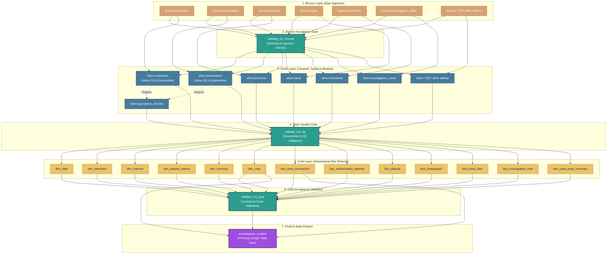

# Data Pipeline Lineage Diagram

This document contains the complete Medallion Data Lineage for the **AI-ready transaction investigation context** pipeline.

## 1. End-to-End Lineage (Mermaid Diagram)



---

## 2. How to Export & Include in Documents

### Option A: Embed Directly in Markdown (GitHub, Azure DevOps, Notion, Obsidian)
Paste the ```mermaid ``` block directly into any markdown documentation file (e.g., `README.md` or `architecture.md`). Most modern tools render standard Mermaid syntax interactively.

### Option B: Export High-Res PNG / SVG / PDF
1. **Online Editor (Instant)**:
   - Copy the Mermaid script above.
   - Open [mermaid.live](https://mermaid.live).
   - Paste the script to preview and download as **PNG**, **SVG**, or **Vector Graphics** for slides and documents.

2. **Mermaid CLI (Automated command)**:
   ```bash
   npx @mermaid-js/mermaid-cli -i pipeline_lineage_diagram.md -o lineage_diagram.png
   ```

### Option C: Databricks Unity Catalog Built-in Lineage
In the Databricks Workspace:
1. Open **Catalog Explorer**.
2. Navigate to your catalog (e.g. `g3_catalog.gold.investigation_context`).
3. Click the **Lineage** tab to see the automatically tracked table-level and column-level lineage graph generated at runtime by Unity Catalog.
