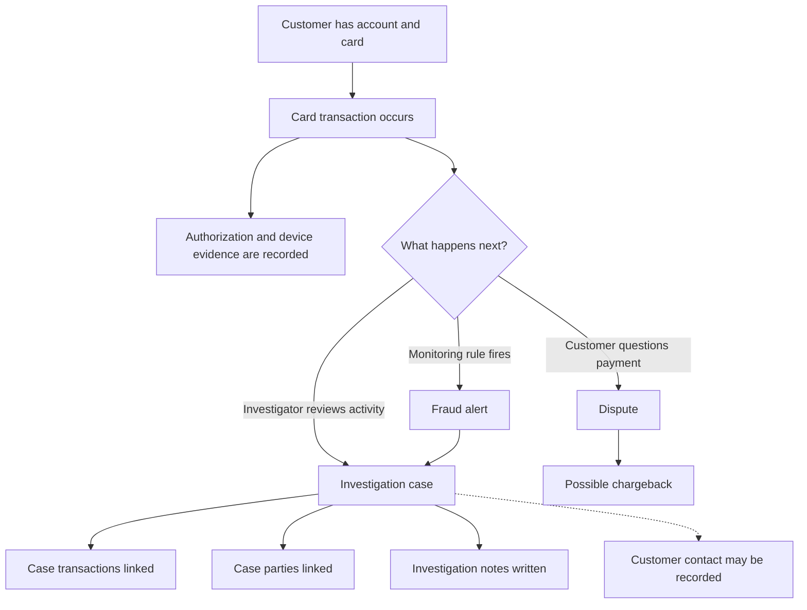
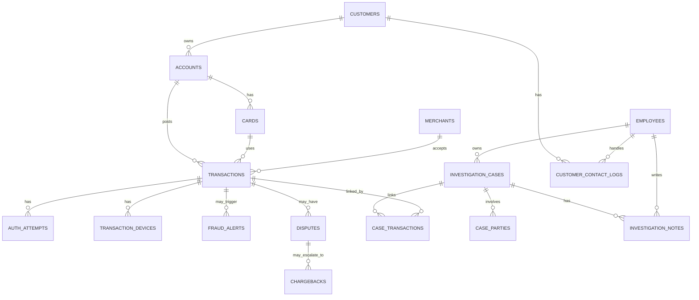

# Transaction Investigation Mock Data

This document describes the synthetic source data used by the Transaction
Investigation pipeline. It has two parts:

1. [Mock data source generation and business logic](#part-1-mock-data-source-generation-and-business-logic)
2. [Source-to-Silver data contracts](#part-2-source-to-silver-data-contracts)


## Part 1: Mock data source generation and business logic

### 1. Business context

This mock data represents a bank transaction investigation process. The goal is
to give the Bronze and Silver pipeline realistic source files to ingest, clean,
validate, and join.

The business story is:

1. A customer may own one or more bank accounts.
2. An account may have one or more cards.
3. A card is used to make transactions with merchants.
4. A transaction may have supporting evidence, such as an authorization attempt
   or device information.
5. A transaction may raise a fraud alert, become a customer dispute, or be
   linked to an investigation case.
6. Investigators review cases, link related transactions and parties, write
   notes, and record customer contacts.
7. Some disputes may become chargebacks. A chargeback is the card-scheme
   process where the bank tries to recover money from the merchant side.

The data is synthetic. It does not represent real customers, real cards, or a
complete regulatory workflow. It is only designed to test data engineering
logic: ingestion, joins, type casting, masking, data quality checks, quarantine,
and simple history handling.

Important business terms:

| Term | Simple meaning in this mock data |
|---|---|
| Authorization attempt | The system check that approves or declines a card payment. |
| Fraud alert | A warning produced by a monitoring rule, such as unusual location or high-risk behavior. |
| Dispute | A customer says a transaction is wrong or unauthorized. |
| Chargeback | A later dispute step where the bank uses card-scheme rules to recover funds. |
| Investigation case | An internal case opened for an investigator to review transactions, people, merchants, notes, and evidence. |
| Legal hold | A restricted case flag. In this project, it means the record must not be exposed to AI output. |
| PAN | Primary Account Number. In simple terms, the card number. The mock uses synthetic PANs only. |
| Bronze | The raw landing layer where source CSV values arrive first. |
| Silver | The cleaned and validated layer used after Bronze. |
| Quarantine | A holding area for records that fail data quality rules. |
| SCD Type 2 | A way to keep history when a dimension changes, such as a customer address changing over time. ( Although the mock data includes SCD2-style changes, Silver uses SCD Type 1 for this use case: it keeps only the latest valid version of each customer, card, and merchant record.) |

### 2. Business flow represented by the data



This diagram explains the business idea. The code does not generate a perfect
step-by-step timeline. Most tables are generated as source extracts, meaning
they look like current records from upstream systems. `customer_contact_logs`
has no `case_id`; its row count is derived from the case count, but it is linked
only to customers and employees.

### 3. How the tables connect

The mock data is generated in parent-to-child order. A parent table is created
first so child tables can reuse its IDs.



The main path is:

```text
customers -> accounts -> cards -> transactions
```

After transactions exist, the generator creates evidence and investigation
tables:

```text
transactions -> auth_attempts
transactions -> transaction_devices
transactions -> fraud_alerts
transactions -> disputes -> chargebacks
investigation_cases <-> case_transactions <-> transactions
investigation_cases -> investigation_notes
investigation_cases -> case_parties
customers -> customer_contact_logs
```

One important design choice: cases and disputes are not directly linked. A
dispute has a `transaction_id`. A case links to transactions through
`case_transactions`. Therefore, a case and a dispute are related only when they
share the same transaction. Do not assume every dispute has a case, or every
case has a dispute.

### 4. How the mock data is created

The generator implementation lives in `mock/`, but this project runs it through
the Databricks notebook `generate_mock_databricks.py`. The notebook installs
Faker, reads its Databricks widgets, calls the generator in the workspace, and
publishes CSV files directly into the Bronze landing volume. No local Python run
or manual file upload is required.

The generator follows this simple pattern:

1. Read configuration from `mock/config.py`.
2. Create a seeded Faker object for names, addresses, emails, companies, and IP
   addresses.
3. Create a seeded random number generator for repeatable choices.
4. Generate reference tables first, such as countries, currencies, channels,
   reason codes, and case status values.
5. Generate business parent tables: customers, employees, accounts, cards, and
   merchants.
6. Store generated IDs in memory so later tables can point to real parent
   records.
7. Generate transaction and investigation tables using those stored IDs.
8. Inject known bad records for data quality testing.
9. Write one CSV file per table.
10. Write the defects manifest, which is published as
    `defects_manifest/defects_manifest<NN>.csv` for the common batch number.

Because the generator uses fixed seeds, the same inputs produce the same
baseline output. The default seed is `42`. The pinned business date is
`2026-07-06`, so "future" and "stale" checks are measured from that date, not
from the day the code runs. Later Databricks batches intentionally differ
because they apply SCD changes to the preceding batch.

### 5. Dataset size and generation order

The Databricks notebook defaults to a development-sized run of 200,000
transactions. Setting its `transactions` widget to `2000000` produces the full
assignment baseline shown below:

| Dataset | Databricks size logic |
|---|---:|
| `customers` | 5,000 |
| `employees` | 200 |
| `merchants` | 2,000 |
| `transactions` | 200,000 by default in Databricks; 2,000,000 for the full baseline |
| `accounts` | about 1.5 accounts per customer |
| `cards` | about 1.2 cards per account |
| `auth_attempts` | about 1.2 per transaction |
| `transaction_devices` | about 0.8 per transaction |
| `disputes` | about 2% of transactions |
| `chargebacks` | about 20% of disputes |
| `fraud_alerts` | about 0.5% of transactions |
| `investigation_cases` | about 0.1% of transactions, minimum 5 |
| `investigation_notes` | about 5 notes per case |
| `case_transactions` | about 3 linked transactions per case |
| `case_parties` | about 2 parties per case |
| `customer_contact_logs` | about 1 per case |
| `date_dim` | every day from `2023-01-01` to `2030-12-31` |

Duplicate test records can add extra physical rows, so a CSV can contain more
rows than the target count.

The generation order matters:

1. Reference tables and calendar
2. Customers and employees
3. Accounts, cards, and merchants
4. Transactions, authorization attempts, and devices
5. Disputes, chargebacks, and fraud alerts
6. Investigation cases, notes, parties, transaction links, and contact logs

This is why the normal data usually joins correctly. For example, transactions
can use real card IDs because cards were already generated.

### 6. Normal business logic used by the generator

The generator creates clean rows first.

| Area | Logic used |
|---|---|
| Customers | Creates synthetic Australian-style customer details, including name, date of birth, email, phone, address, and tax ID. |
| Accounts | Assigns each account to an existing customer. Most accounts are active and use AUD. |
| Cards | Assigns each card to an existing account. Cards have a type, PAN, expiry, status, and effective date. |
| Merchants | Creates synthetic merchants with category, country, risk rating, and status. |
| Transactions | Chooses a card, uses that card's account, chooses a merchant, channel, amount, currency, timestamp, and status. |
| Authorization attempts | Links to sampled transactions and records whether the payment was approved or declined. |
| Devices | Links to sampled transactions and records device type, IP address, and country. |
| Disputes | Links to sampled transactions and records reason, amount, status, and raised date. |
| Chargebacks | Links to disputes and records scheme, amount, stage, and processed date. |
| Fraud alerts | Links to sampled transactions and records rule name, score, time, and disposition. |
| Investigation cases | Creates cases with priority, status, fraud type, owner, dates, and legal-hold flag. |
| Notes | Links notes to cases and employees. |
| Case parties | Links cases to customers, merchants, or synthetic third parties. |
| Contact logs | Links customers and employees to contact activity. |

Some fields are intentionally independent to keep the mock simple. For example,
a dispute amount does not have to equal the transaction amount. A fraud alert is
not guaranteed to create a case. A chargeback stage is only the current stage,
not a full stage-by-stage history.

### 7. Data quality test logic

After clean rows are created, the generator deliberately changes some rows into
bad rows. This exercises the DQ and Silver quarantine behavior without assuming
that manifest reconciliation has perfect recall or precision.

The default defect rate is `0.05`, or 5%. The actual count varies by rule
because each defect type has its own weight. Examples of injected issues are:

| Area | Example intentional issue |
|---|---|
| Customers | Missing email, duplicate customer ID, near-duplicate customer identity. |
| Employees | Duplicate employee email and near-duplicate employee name. |
| Accounts | Account points to a customer ID that does not exist, or has a future open date. |
| Cards | Active card is already expired, or card ID is duplicated. |
| Merchants | Risk rating has invalid casing, such as `HIGH` instead of `high`. |
| Transactions | Negative amount, missing merchant, duplicate transaction ID, future timestamp, closed card, or account/card IDs that do not exist. |
| Authorization attempts | Authorization points to a transaction that does not exist, or has an invalid time. |
| Devices | Device record points to a transaction that does not exist, or is missing device type. |
| Disputes | Dispute points to a transaction that does not exist, has invalid status casing, or is missing a reason code. |
| Chargebacks | Chargeback points to a dispute that does not exist. |
| Fraud alerts | Alert score is outside the expected range. |
| Investigation cases | Case has invalid status, is stale, or has `legal_hold=true`. |
| Notes and contact logs | Free text contains synthetic sensitive data that should be masked or blocked. |
| Case links and parties | Link points to a transaction that does not exist, or party type/party ID does not resolve correctly. |

#### Dataset-level quality-problem coverage

The assignment requires quality-problem documentation for every source dataset.
The table below distinguishes deliberately seeded defects from clean reference
datasets that are still covered by schema, type, or relationship validation.

| Dataset | Example quality problem or explicit clean-data status |
|---|---|
| `customers` | Seeded empty email, duplicate `customer_id`, and duplicate identity attributes under a different ID. |
| `accounts` | Seeded orphan `customer_id` and future `open_date`. |
| `cards` | Seeded duplicate `card_id` and active card with an expired `expiry`. |
| `merchants` | Seeded invalid `risk_rating` casing. |
| `merchant_categories` | No dedicated seeded defect; generated as a clean MCC lookup and checked through downstream merchant references. |
| `countries` | No dedicated seeded defect; generated as a clean ISO-like lookup and checked by merchant, branch, and device references. |
| `currencies` | No dedicated seeded defect; `decimals` is protected by an integer cast check. |
| `channels` | No dedicated seeded defect; generated as a clean lookup and checked through transaction references. |
| `branches` | No dedicated seeded defect; generated as a clean lookup with country references. |
| `date_dim` | No dedicated seeded defect; date, year, month, quarter, and weekend fields have executable type checks. |
| `transactions` | Seeded duplicate ID, negative amount, missing merchant, orphan account/card, future timestamp, and use of a closed card. |
| `auth_attempts` | Seeded orphan transaction and `auth_ts` later than the related transaction. |
| `transaction_devices` | Seeded orphan transaction and missing `device_type`. |
| `disputes` | Seeded orphan transaction, invalid status casing, and missing reason code. |
| `dispute_reason_codes` | No dedicated seeded defect; generated as a clean lookup and checked through dispute references. |
| `chargebacks` | Seeded orphan `dispute_id`; amount and timestamp casts are also validated. |
| `fraud_alerts` | Seeded score outside `[0,1]`; transaction reference and runtime casts are also validated. |
| `fraud_types` | No dedicated seeded defect; generated as a clean lookup and checked through case references. |
| `investigation_cases` | Seeded invalid status, stale open case, and `legal_hold=true` AI exclusion. |
| `case_status_types` | No dedicated seeded defect; generated as a clean lookup and checked through case status references. |
| `employees` | Seeded duplicate email and duplicate/near-duplicate full name. |
| `investigation_notes` | Seeded PII/PAN leakage and notes linked to legal-hold cases; case and employee references are validated. |
| `case_transactions` | Seeded orphan transaction; case reference and `linked_at` cast are also validated. |
| `case_parties` | Seeded invalid `party_type` and a `party_id` that does not resolve for its declared type. |
| `customer_contact_logs` | Seeded do-not-contact violation and PII/PAN leakage; customer and employee references are validated. |

Every injected issue is logged in the batch's `defects_manifest<NN>.csv`:

```text
source_table, record_key, rule_id, rule_name, failure_reason, severity
```

This manifest is the seeded-defect oracle used for data quality reconciliation.
It is compared with the DQ quarantine by
`pipeline/validation/validate_m2_dq.py`. The comparison is diagnostic rather
than a perfect-recall or perfect-precision assertion: the current evidence
contains both manifest keys missed by DQ and additional keys found by executable
rules, and reports those differences as warnings.

The manifest records injected issues, not every possible issue that random data
might naturally create. One source row can also have more than one defect.

#### Generated output samples

The following deterministic examples show the expected CSV format. They use
fixed IDs, values, and timestamps so they do not change between reviews. The
examples deliberately contain normal and defective source rows. Defect metadata
is not added to the source CSVs: the source schemas remain unchanged, and the
separate manifest identifies the injected problems.

| Source | Rows | Purpose | Primary key | Sensitive fields | Relationships |
|---|---:|---|---|---|---|
| `customers/customer01.csv` | 4 | Customer identity and contact source. | `customer_id` | Direct identifiers: `first_name`, `last_name`; sensitive: `dob`, `address`, `tax_id`; contact: `email`, `phone`. | One customer can own many accounts through `accounts.customer_id`. |
| `accounts/account01.csv` | 5 | Customer account and product source. | `account_id` | No fields are classified as sensitive in the source contract; `customer_id` is an internal relationship key. | Many accounts can reference one `customers.customer_id`; one account can have many `transactions.account_id` rows. |
| `transactions/transaction01.csv` | 5 | Payment activity source used for investigation. | `transaction_id` | No fields are classified as sensitive in the source contract; all are internal. | Each row references `accounts.account_id`; it also references `cards.card_id`, `merchants.merchant_id`, `channels.channel_code`, and `currencies.currency_code`. |
| `defects_manifest/defects_manifest01.csv` | 3 | Expected-defect oracle for the three source samples. | `source_table`, `record_key`, `rule_id` | `failure_reason` can describe source values and must be handled as controlled quality evidence. | Each row points to the affected source row using `source_table` and its natural `record_key`. |

##### Customers sample

```csv
customer_id,first_name,last_name,dob,email,phone,address,tax_id,created_at,effective_at
CUST-0001,Ava,Nguyen,1992-04-18,ava.nguyen@example.test,+61400000001,"10 Sample Street, Melbourne VIC",100000001,2026-07-01T09:00:00Z,2026-07-01T09:00:00Z
CUST-0002,Liam,Tran,1987-11-02,liam.tran@example.test,+61400000002,"20 Sample Street, Sydney NSW",100000002,2026-07-01T09:05:00Z,2026-07-01T09:05:00Z
CUST-0003,Mia,Patel,1995-08-21,mia.patel@example.test,+61400000003,"30 Sample Street, Brisbane QLD",100000003,2026-07-01T09:10:00Z,2026-07-01T09:10:00Z
CUST-0004,Noah,Smith,1979-01-30,invalid-email,+61400000004,"40 Sample Street, Perth WA",100000004,2026-07-01T09:15:00Z,2026-07-01T09:15:00Z
```

##### Accounts sample

```csv
account_id,customer_id,product_type,open_date,status,currency
ACC-0001,CUST-0001,Everyday,2020-03-12,active,AUD
ACC-0002,CUST-0001,Savings,2021-06-08,active,AUD
ACC-0003,CUST-0002,Credit,2022-09-15,active,AUD
ACC-0004,CUST-0003,Debit,2024-02-20,dormant,AUD
ACC-0005,CUST-9999,Everyday,2025-05-10,active,AUD
```

##### Transactions sample

```csv
transaction_id,account_id,card_id,merchant_id,channel,amount,currency,txn_ts,status
TXN-000001,ACC-0001,CARD-0001,MCH-0001,pos,42.50,AUD,2026-07-05T08:30:00Z,settled
TXN-000002,ACC-0002,CARD-0002,MCH-0002,online,125.00,AUD,2026-07-05T10:15:00Z,authorized
TXN-000003,ACC-0003,CARD-0003,MCH-0001,mobile,19.95,AUD,2026-07-06T01:20:00Z,settled
TXN-000004,ACC-0004,CARD-0004,MCH-0003,atm,200.00,AUD,2026-07-06T03:45:00Z,authorized
TXN-000005,ACC-0001,CARD-0001,MCH-0002,online,-25.00,AUD,2026-07-06T04:10:00Z,settled
```

##### Matching defects manifest sample

```csv
source_table,record_key,rule_id,rule_name,failure_reason,severity
customers,CUST-0004,DQ-CUST-EMAIL-FMT,email must match pattern if present,email value 'invalid-email' is malformed,quarantine
accounts,ACC-0005,DQ-ACC-CUST-FK,customer_id must exist in customers,customer_id CUST-9999 does not exist in customers,quarantine
transactions,TXN-000005,DQ-TXN-AMT-POS,amount must be > 0,amount -25.00 is not greater than zero,quarantine
```

The full field definitions are in the existing [customers](#customers),
[accounts](#accounts), and [transactions](#transactions) contracts below.
`CARD-0001`–`CARD-0004`, `MCH-0001`–`MCH-0003`, and the channel and currency
codes are representative valid companion keys. Their source rows are omitted
to keep this review fixture small. Therefore, when testing only these three
files, validate their schemas, their customer-to-account-to-transaction path,
and the three manifest defects. Load the companion source datasets before
enabling the card, merchant, channel, and currency relationship checks in a
full pipeline run.

To replace the fixture with Databricks data, export the same columns in the
same order, retain CSV headers, preserve the table-first paths, and use one
common batch suffix such as `01`. Do not copy the sample's invalid records into
a production extract. If defects are intentionally seeded for a test batch,
write one manifest row per expected rule failure using the six-column manifest
schema shown above.

#### Example quality problems

The fixture has exactly one intentional failure in each source dataset and
three corresponding manifest entries:

| Source record | Intentional problem | Expected rule | Expected handling |
|---|---|---|---|
| `customers.CUST-0004` | `email` is `invalid-email`, which is not a valid email shape. | `DQ-CUST-EMAIL-FMT` | Quarantine the customer row. |
| `accounts.ACC-0005` | `customer_id=CUST-9999` does not resolve to the customer sample. | `DQ-ACC-CUST-FK` | Quarantine the account row. |
| `transactions.TXN-000005` | `amount=-25.00` violates the positive-amount rule. | `DQ-TXN-AMT-POS` | Quarantine the transaction row. |

All other rows are valid within the three-file review scope. The manifest is a
seeded-defect oracle, not a replacement for executing the DQ rules: additional
issues in replacement data can still be detected even when they are absent
from the manifest.

### 8. Transaction sampling and large files

Transactions can reach 2 million rows, so the generator does not keep every
transaction in memory for later joins. It writes large tables as streams and
keeps a sample of transaction IDs and timestamps.

Later tables such as disputes, alerts, devices, authorization attempts, and
case links choose from this retained transaction sample. This keeps generation
fast and memory-bounded, while still giving child tables realistic transaction
references.

### 9. SCD Type 2 batch logic

The Databricks generator models descriptive changes across complete numbered
source batches. Only three dimensions have this change behavior:

| Table | What can change | Business meaning |
|---|---|---|
| `customers` | `address` | Customer moved. |
| `cards` | `status` | Card lifecycle changed, such as active to blocked. |
| `merchants` | `risk_rating` | Merchant risk was reassessed. |

Batch 01 is a complete baseline extract. Each later run receives the next common
batch number, restores the complete preceding batch, changes a small number of
clean customer, card, and merchant rows, and advances their `effective_at`
values by the configured 30-day interval. Defective rows are excluded from SCD
changes so the DQ and SCD manifests do not describe the same mutation.

The batch layout is table-first:

```text
raw_data/
  customers/customer01.csv
  customers/customer02.csv
  cards/card01.csv
  cards/card02.csv
  merchants/merchant01.csv
  merchants/merchant02.csv
```

`scd_changes_manifest/scd_changes_manifest<NN>.csv` is cumulative and records
the expected changes across batches. Bronze retains all newly ingested batch
files with `_batch_id` and `_run_id` lineage. Silver reads only the maximum
`_batch_id`, uses `effective_at` to resolve duplicate customer/card business
keys, and overwrites its managed tables with the latest valid current state.
This is current-state/SCD Type 1 publication rather than a Type 2 Silver history
table.

### 10. Databricks generation

`generate_mock_databricks.py` runs the same generator inside Databricks and
writes the result to:

```text
/Volumes/<catalog>/bronze/raw_data
```

On the first batch, it generates new mock data. On later batches, it restores
the preceding batch and applies SCD changes. Later batches are therefore
complete source extracts with small customer, card, and merchant changes.

Files are staged first and only published after generation succeeds. Published
files use one batch number across all tables, for example:

```text
customers/customer01.csv
transactions/transaction01.csv
defects_manifest/defects_manifest01.csv
scd_changes_manifest/scd_changes_manifest01.csv
```

For later batches, the notebook also repairs transaction account links so the
card remains the main source for which account owns the transaction. Unknown
cards are left unchanged because they are intentional data quality test cases.

### 11. Important limitations

- The data is synthetic and does not represent real customers, accounts, cards,
  merchants, employees, or investigations.
- The records are source-style extracts, not a complete event-by-event process
  history.
- Cases and disputes do not have a direct key relationship.
- A fraud alert is not guaranteed to create a case.
- A disputed transaction is not guaranteed to have a chargeback.
- Dispute amounts, chargeback amounts, and transaction amounts are generated
  independently.
- `legal_hold` is a project restriction flag, not a full legal workflow.
- Synthetic names, addresses, emails, phones, tax IDs, PANs, notes, and IP
  addresses are treated as sensitive so masking and redaction can be tested.
- The business context explains why the tables exist. It does not claim the mock
  process fully complies with payment, AML, or card-scheme rules.

## Part 2: Source-to-Silver data contracts

### 12. How to read the contracts

There is one YAML contract per generated domain CSV under
`docs/contracts/sources`. The tables below are a reconciled human-readable view:
`mock.config.TABLE_SCHEMAS` defines physical CSV column order, the YAML files
provide requiredness, keys, classifications, and declared values, and the
executable DQ registry and Silver notebooks define the runtime rules and casts.
When a YAML declaration differs from executable behavior, this view reports the
runtime behavior.

Legacy local source paths from the YAML metadata are not used for execution or
rendered as physical locations here. The deployed Databricks source pattern is
`/Volumes/<catalog>/bronze/raw_data/<table>/<singular><NN>.csv`. `<NN>` is not
an abbreviation; it is a placeholder for the common, zero-padded two-digit
batch number (`01`, `02`, and so on). For example, the `case_transactions`
dataset uses `case_transactions/case_transaction01.csv` in batch 01. Raw values
land in Bronze as strings. Silver selects the newest batch, performs type
coercion, validation, masking, and quarantine routing, then overwrites the
current-state tables.

All contracts below have schema version `1.0.0`, layer `source_to_silver`,
contractual type layer `silver`, default failure disposition `quarantined`, and
failure destination `silver.quarantine_records`.

Conventions:

- **PK** is taken from the YAML `primary_key`.
- **FK** is shown only when the YAML field declares `references`.
- **—** means no reference, declared accepted-value list, or executable DQ rule
  applies to that field; unconstrained descriptive text remains governed by its
  type and requiredness.
- Readable patterns such as `CUST-<digits>`, `YYYY-MM-DD`, and
  `####-####-####-####` describe the generated wire format rather than a
  programming-language-specific regular expression.
- Types are the declared or runtime cast types used during Bronze-to-Silver
  processing, not necessarily the final representation after privacy
  transformations.
- Customer names are tokenized, date of birth becomes an age band, addresses
  and tax IDs are hashed, emails and phones are masked, and card PANs retain only
  their last four digits in Silver.
- `customers.effective_at` and `cards.effective_at` select the latest version but
  are not projected to final Silver; `merchants.effective_at` is retained.
- Classification describes sensitivity and handling, not a data type.
- Names, contacts, addresses, identifiers, and PANs shown in the Example column
  are explicitly synthetic test values; they do not identify real people or
  accounts.

### 13. Contract index

| Business area | Contracts |
|---|---|
| Customer and payment instrument | [customers](#customers), [accounts](#accounts), [cards](#cards) |
| Merchant and reference | [merchants](#merchants), [merchant_categories](#merchant_categories), [countries](#countries), [currencies](#currencies), [channels](#channels), [branches](#branches), [date_dim](#date_dim) |
| Transaction evidence | [transactions](#transactions), [auth_attempts](#auth_attempts), [transaction_devices](#transaction_devices) |
| Dispute and chargeback | [disputes](#disputes), [dispute_reason_codes](#dispute_reason_codes), [chargebacks](#chargebacks) |
| Investigation | [fraud_alerts](#fraud_alerts), [fraud_types](#fraud_types), [investigation_cases](#investigation_cases), [case_status_types](#case_status_types), [employees](#employees), [investigation_notes](#investigation_notes), [case_transactions](#case_transactions), [case_parties](#case_parties), [customer_contact_logs](#customer_contact_logs) |

### customers

Databricks source: `/Volumes/<catalog>/bronze/raw_data/customers/customer<NN>.csv`<br>
Purpose: Mock source dataset for customers.  
Grain: one row per customer  
Primary key: `customer_id`

| Field | Type | Required | Key / reference | Accepted values / pattern | Classification | DQ rules | Example |
|---|---|---:|---|---|---|---|---|
| `customer_id` | string | yes | PK | `CUST-<digits>` | internal | `DQ-CUST-ID-DUP`, `DQ-CUST-NEAR-DUP` | `CUST-0001` |
| `first_name` | string | yes | — | non-empty text | direct_identifier | — | `Sample` |
| `last_name` | string | yes | — | non-empty text | direct_identifier | — | `Customer` |
| `dob` | date | yes | — | `YYYY-MM-DD` | sensitive | `DQ-CUST-DOB-TYPE` | `1990-05-20` |
| `email` | string | no | — | `local@domain.tld` if present | contact | `DQ-CUST-EMAIL-FMT` | `sample.customer@example.test` |
| `phone` | string | no | — | `+61` followed by 9 digits | contact | — | `+61400000000` |
| `address` | string | no | — | free text if present | sensitive | — | `1 Example Street, Sampleville` |
| `tax_id` | string | no | — | 9 digits if present | sensitive | — | `123456789` |
| `created_at` | timestamp | yes | — | ISO-8601 timestamp | internal | `DQ-CUST-CREATED-TYPE` | `2026-07-06T10:00:00Z` |
| `effective_at` | timestamp | yes | — | ISO-8601 timestamp | internal | — | `2026-07-06T10:00:00Z` |

### accounts

Databricks source: `/Volumes/<catalog>/bronze/raw_data/accounts/account<NN>.csv`<br>
Purpose: Mock source dataset for accounts.  
Grain: one row per account  
Primary key: `account_id`

| Field | Type | Required | Key / reference | Accepted values / pattern | Classification | DQ rules | Example |
|---|---|---:|---|---|---|---|---|
| `account_id` | string | yes | PK | `ACC-<digits>` | internal | — | `ACC-0001` |
| `customer_id` | string | yes | FK → `customers.customer_id` | — | internal | `DQ-ACC-CUST-FK` | `CUST-0001` |
| `product_type` | string | yes | — | `Everyday`, `Savings`, `Credit`, `Debit` | internal | — | `Everyday` |
| `open_date` | date | yes | — | `YYYY-MM-DD`; not after `2026-07-06` | internal | `DQ-ACC-OPENDATE-FUTURE`, `DQ-ACC-OPENDATE-TYPE` | `2026-07-06` |
| `status` | string | yes | — | `active`, `dormant`, `closed`, `frozen` | internal | — | `active` |
| `currency` | string | yes | — | `AUD` | internal | — | `AUD` |

### cards

Databricks source: `/Volumes/<catalog>/bronze/raw_data/cards/card<NN>.csv`<br>
Purpose: Mock source dataset for cards.  
Grain: one row per card  
Primary key: `card_id`

| Field | Type | Required | Key / reference | Accepted values / pattern | Classification | DQ rules | Example |
|---|---|---:|---|---|---|---|---|
| `card_id` | string | yes | PK | `CARD-<digits>` | internal | `DQ-CARD-DUP` | `CARD-0001` |
| `account_id` | string | yes | FK → `accounts.account_id` | — | internal | `DQ-CARD-ACCT-FK` | `ACC-0001` |
| `card_type` | string | yes | — | `debit`, `credit` | internal | — | `debit` |
| `pan` | string | yes | — | `####-####-####-####` | payment_card | — | `4111-1111-1111-1111` |
| `expiry` | string | yes | — | `YYYY-MM` | internal | `DQ-CARD-EXPIRED-ACTIVE` | `2028-12` |
| `status` | string | yes | — | `active`, `blocked`, `expired`, `closed` | internal | — | `active` |
| `effective_at` | timestamp | yes | — | ISO-8601 timestamp | internal | — | `2026-07-06T10:00:00Z` |

### merchants

Databricks source: `/Volumes/<catalog>/bronze/raw_data/merchants/merchant<NN>.csv`<br>
Purpose: Mock source dataset for merchants.  
Grain: one row per merchant  
Primary key: `merchant_id`

| Field | Type | Required | Key / reference | Accepted values / pattern | Classification | DQ rules | Example |
|---|---|---:|---|---|---|---|---|
| `merchant_id` | string | yes | PK | `MCH-<digits>` | internal | — | `MCH-0001` |
| `name` | string | yes | — | — | internal | — | `Example Electronics` |
| `mcc` | string | yes | FK → `merchant_categories.mcc` | — | internal | — | `5732` |
| `country` | string | yes | FK → `countries.iso_code` | — | internal | — | `AU` |
| `risk_rating` | string | yes | — | `low`, `medium`, `high` | internal | `DQ-MERCH-RISK-CASING` | `low` |
| `status` | string | yes | — | `active`, `suspended`, `closed` | internal | — | `active` |
| `effective_at` | timestamp | yes | — | ISO-8601 timestamp | internal | `DQ-MERCH-EFFECTIVE-TYPE` | `2026-07-06T10:00:00Z` |

### merchant_categories

Databricks source: `/Volumes/<catalog>/bronze/raw_data/merchant_categories/merchant_category<NN>.csv`<br>
Purpose: Mock source dataset for merchant categories.  
Grain: one row per merchant category<br>
Primary key: `mcc`

| Field | Type | Required | Key / reference | Accepted values / pattern | Classification | DQ rules | Example |
|---|---|---:|---|---|---|---|---|
| `mcc` | string | yes | PK | 4 digits | internal | — | `5732` |
| `category_name` | string | yes | — | — | internal | — | `Electronics` |
| `category_group` | string | yes | — | — | internal | — | `Retail` |

### countries

Databricks source: `/Volumes/<catalog>/bronze/raw_data/countries/country<NN>.csv`<br>
Purpose: Mock source dataset for countries.  
Grain: one row per country<br>
Primary key: `iso_code`

| Field | Type | Required | Key / reference | Accepted values / pattern | Classification | DQ rules | Example |
|---|---|---:|---|---|---|---|---|
| `iso_code` | string | yes | PK | 2 uppercase letters | internal | — | `AU` |
| `name` | string | yes | — | — | internal | — | `Australia` |
| `region` | string | yes | — | `APAC`, `AMER`, `EMEA` | internal | — | `APAC` |

### currencies

Databricks source: `/Volumes/<catalog>/bronze/raw_data/currencies/currency<NN>.csv`<br>
Purpose: Mock source dataset for currencies.  
Grain: one row per currency<br>
Primary key: `currency_code`

| Field | Type | Required | Key / reference | Accepted values / pattern | Classification | DQ rules | Example |
|---|---|---:|---|---|---|---|---|
| `currency_code` | string | yes | PK | `AUD`, `USD`, `NZD`, `GBP`, `SGD` | internal | — | `AUD` |
| `name` | string | yes | — | — | internal | — | `Australian Dollar` |
| `decimals` | integer | yes | — | `2` | internal | `DQ-CURR-DECIMALS-TYPE` | `2` |

### channels

Databricks source: `/Volumes/<catalog>/bronze/raw_data/channels/channel<NN>.csv`<br>
Purpose: Mock source dataset for channels.  
Grain: one row per channel  
Primary key: `channel_code`

| Field | Type | Required | Key / reference | Accepted values / pattern | Classification | DQ rules | Example |
|---|---|---:|---|---|---|---|---|
| `channel_code` | string | yes | PK | `pos`, `online`, `mobile`, `atm` | internal | — | `online` |
| `channel_name` | string | yes | — | — | internal | — | `E-Commerce` |

### branches

Databricks source: `/Volumes/<catalog>/bronze/raw_data/branches/branch<NN>.csv`<br>
Purpose: Mock source dataset for branches.  
Grain: one row per branch<br>
Primary key: `branch_code`

| Field | Type | Required | Key / reference | Accepted values / pattern | Classification | DQ rules | Example |
|---|---|---:|---|---|---|---|---|
| `branch_code` | string | yes | PK | `BR-<2 digits>` | internal | — | `BR-01` |
| `name` | string | yes | — | — | internal | — | `Melbourne Flagship` |
| `country` | string | yes | FK → `countries.iso_code` | — | internal | — | `AU` |
| `region` | string | yes | — | `VIC`, `NSW`, `QLD`, `WA` | internal | — | `VIC` |
| `status` | string | yes | — | `active`, `closed` | internal | — | `active` |

### date_dim

Databricks source: `/Volumes/<catalog>/bronze/raw_data/date_dim/date_dim<NN>.csv`<br>
Purpose: Mock source dataset for date dim.  
Grain: one row per calendar day  
Primary key: `date_id`

| Field | Type | Required | Key / reference | Accepted values / pattern | Classification | DQ rules | Example |
|---|---|---:|---|---|---|---|---|
| `date_id` | date | yes | PK | source `YYYYMMDD`; Silver date | internal | `DQ-DATE-ID-TYPE` | `20260706` |
| `year` | integer | yes | — | `2023`–`2030` | internal | `DQ-DATE-YEAR-TYPE` | `2026` |
| `month` | integer | yes | — | `1`–`12` | internal | `DQ-DATE-MONTH-TYPE` | `7` |
| `quarter` | integer | yes | — | `1`–`4` | internal | `DQ-DATE-QUARTER-TYPE` | `3` |
| `is_weekend` | boolean | yes | — | `true`, `false` | internal | `DQ-DATE-WEEKEND-TYPE` | `false` |

### transactions

Databricks source: `/Volumes/<catalog>/bronze/raw_data/transactions/transaction<NN>.csv`<br>
Purpose: Mock source dataset for transactions.  
Grain: one row per transaction  
Primary key: `transaction_id`

| Field | Type | Required | Key / reference | Accepted values / pattern | Classification | DQ rules | Example |
|---|---|---:|---|---|---|---|---|
| `transaction_id` | string | yes | PK | `TXN-<digits>` | internal | `DQ-TXN-ID-DUP` | `TXN-000001` |
| `account_id` | string | yes | FK → `accounts.account_id` | — | internal | `DQ-TXN-ACCT-FK` | `ACC-0001` |
| `card_id` | string | yes | FK → `cards.card_id` | — | internal | `DQ-TXN-CARD-ACTIVE`, `DQ-TXN-CARD-FK` | `CARD-0001` |
| `merchant_id` | string | yes | FK → `merchants.merchant_id` | — | internal | `DQ-TXN-MERCH-REQ`, `DQ-TXN-MERCH-FK` | `MCH-0001` |
| `channel` | string | yes | FK → `channels.channel_code` | `pos`, `online`, `mobile`, `atm` | internal | — | `online` |
| `amount` | decimal(12,2) | yes | — | greater than `0` | internal | `DQ-TXN-AMT-POS`, `DQ-TXN-AMOUNT-TYPE` | `100.00` |
| `currency` | string | yes | FK → `currencies.currency_code` | `AUD`, `USD`, `NZD`, `GBP`, `SGD` | internal | — | `AUD` |
| `txn_ts` | timestamp | yes | — | ISO-8601; not after `2026-07-06` | internal | `DQ-TXN-TS-FUTURE`, `DQ-TXN-TS-TYPE` | `2026-07-06T10:00:00Z` |
| `status` | string | yes | — | `authorized`, `settled`, `declined`, `reversed`, `refunded` | internal | — | `authorized` |

### auth_attempts

Databricks source: `/Volumes/<catalog>/bronze/raw_data/auth_attempts/auth_attempt<NN>.csv`<br>
Purpose: Mock source dataset for auth attempts.  
Grain: one row per authorization attempt<br>
Primary key: `attempt_id`

| Field | Type | Required | Key / reference | Accepted values / pattern | Classification | DQ rules | Example |
|---|---|---:|---|---|---|---|---|
| `attempt_id` | string | yes | PK | `AUTH-<digits>` | internal | — | `AUTH-000001` |
| `transaction_id` | string | yes | FK → `transactions.transaction_id` | — | internal | `DQ-AUTH-TXN-FK` | `TXN-000001` |
| `decision` | string | yes | — | `approved`, `declined` | internal | — | `approved` |
| `decline_reason` | string | no | — | `insufficient_funds`, `incorrect_pin`, `suspected_fraud`, `expired_card`, `do_not_honour`; blank when approved | internal | — | `suspected_fraud` |
| `auth_ts` | timestamp | yes | — | ISO-8601; no later than related `txn_ts` | internal | `DQ-AUTH-TS-ORDER`, `DQ-AUTH-TS-TYPE` | `2026-07-06T09:59:00Z` |

### transaction_devices

Databricks source: `/Volumes/<catalog>/bronze/raw_data/transaction_devices/transaction_device<NN>.csv`<br>
Purpose: Mock source dataset for transaction devices.  
Grain: one row per transaction device<br>
Primary key: `device_id`

| Field | Type | Required | Key / reference | Accepted values / pattern | Classification | DQ rules | Example |
|---|---|---:|---|---|---|---|---|
| `device_id` | string | yes | PK | `DEV-<digits>` | device_identifier | — | `DEV-000001` |
| `transaction_id` | string | yes | FK → `transactions.transaction_id` | — | internal | `DQ-DEV-TXN-FK` | `TXN-000001` |
| `device_type` | string | yes | — | `mobile_ios`, `mobile_android`, `web`, `pos_terminal`, `atm` | internal | `DQ-DEV-TYPE-REQ` | `mobile_ios` |
| `ip` | string | yes | — | public IPv4 address | network_identifier | — | `203.0.113.10` |
| `geo_country` | string | yes | FK → `countries.iso_code` | 2 uppercase letters | internal | — | `AU` |

### disputes

Databricks source: `/Volumes/<catalog>/bronze/raw_data/disputes/dispute<NN>.csv`<br>
Purpose: Mock source dataset for disputes.  
Grain: one row per dispute  
Primary key: `dispute_id`

| Field | Type | Required | Key / reference | Accepted values / pattern | Classification | DQ rules | Example |
|---|---|---:|---|---|---|---|---|
| `dispute_id` | string | yes | PK | `DSP-<digits>` | internal | — | `DSP-0001` |
| `transaction_id` | string | yes | FK → `transactions.transaction_id` | — | internal | `DQ-DISP-TXN-FK` | `TXN-000001` |
| `reason_code` | string | yes | FK → `dispute_reason_codes.reason_code` | `10.4`, `13.1`, `13.7` | internal | `DQ-DISP-REASON-REQ` | `10.4` |
| `amount` | decimal(18,2) | yes | — | decimal numeric value | internal | `DQ-DISP-AMOUNT-TYPE` | `100.00` |
| `status` | string | yes | — | `open`, `in_review`, `resolved`, `rejected`, `withdrawn` | internal | `DQ-DISP-STATUS-ENUM` | `open` |
| `raised_at` | timestamp | yes | — | ISO-8601 timestamp | internal | `DQ-DISP-RAISED-TYPE` | `2026-07-06T10:00:00Z` |

### dispute_reason_codes

Databricks source: `/Volumes/<catalog>/bronze/raw_data/dispute_reason_codes/dispute_reason_code<NN>.csv`<br>
Purpose: Mock source dataset for dispute reason codes.  
Grain: one row per dispute reason code<br>
Primary key: `reason_code`

| Field | Type | Required | Key / reference | Accepted values / pattern | Classification | DQ rules | Example |
|---|---|---:|---|---|---|---|---|
| `reason_code` | string | yes | PK | `10.4`, `13.1`, `13.7` | internal | — | `10.4` |
| `description` | string | yes | — | — | internal | — | `Fraud - Card Absent` |

### chargebacks

Databricks source: `/Volumes/<catalog>/bronze/raw_data/chargebacks/chargeback<NN>.csv`<br>
Purpose: Mock source dataset for chargebacks.  
Grain: one row per chargeback  
Primary key: `chargeback_id`

| Field | Type | Required | Key / reference | Accepted values / pattern | Classification | DQ rules | Example |
|---|---|---:|---|---|---|---|---|
| `chargeback_id` | string | yes | PK | `CBK-<digits>` | internal | — | `CBK-0001` |
| `dispute_id` | string | yes | FK → `disputes.dispute_id` | — | internal | `DQ-CBK-DISP-FK` | `DSP-0001` |
| `scheme` | string | yes | — | `visa`, `mastercard`, `amex` | internal | — | `visa` |
| `amount` | double | yes | — | numeric value | internal | `DQ-CBK-AMOUNT-TYPE` | `100.00` |
| `stage` | string | yes | — | `representment`, `pre_arbitration`, `won`, `lost`, `reversed` | internal | — | `representment` |
| `processed_at` | timestamp | yes | — | ISO-8601 timestamp | internal | `DQ-CBK-PROCESSED-TYPE` | `2026-07-06T10:00:00Z` |

### fraud_alerts

Databricks source: `/Volumes/<catalog>/bronze/raw_data/fraud_alerts/fraud_alert<NN>.csv`<br>
Purpose: Mock source dataset for fraud alerts.  
Grain: one row per fraud alert<br>
Primary key: `alert_id`

| Field | Type | Required | Key / reference | Accepted values / pattern | Classification | DQ rules | Example |
|---|---|---:|---|---|---|---|---|
| `alert_id` | string | yes | PK | `ALT-<digits>` | internal | — | `ALT-0001` |
| `transaction_id` | string | yes | FK → `transactions.transaction_id` | — | internal | `DQ-ALT-TXN-FK` | `TXN-000001` |
| `rule_name` | string | yes | — | `velocity_5min`, `geo_mismatch`, `high_value_night`, `new_device_high_value` | internal | — | `high_value_night` |
| `score` | double | yes | — | `0.0`–`1.0` | internal | `DQ-ALT-SCORE-RANGE`, `DQ-ALT-SCORE-TYPE` | `0.85` |
| `triggered_at` | timestamp | yes | — | ISO-8601 timestamp | internal | `DQ-ALT-TRIGGERED-TYPE` | `2026-07-06T10:00:00Z` |
| `disposition` | string | yes | — | `open`, `escalated_to_case`, `dismissed`, `true_positive`, `false_positive` | internal | — | `open` |

### fraud_types

Databricks source: `/Volumes/<catalog>/bronze/raw_data/fraud_types/fraud_type<NN>.csv`<br>
Purpose: Mock source dataset for fraud types.  
Grain: one row per fraud type<br>
Primary key: `fraud_type_code`

| Field | Type | Required | Key / reference | Accepted values / pattern | Classification | DQ rules | Example |
|---|---|---:|---|---|---|---|---|
| `fraud_type_code` | string | yes | PK | `card_fraud`, `account_takeover`, `sar`, `none` | internal | — | `card_fraud` |
| `description` | string | yes | — | — | internal | — | `Card compromise` |
| `severity` | string | yes | — | `low`, `high`, `critical` | internal | — | `high` |

### investigation_cases

Databricks source: `/Volumes/<catalog>/bronze/raw_data/investigation_cases/investigation_case<NN>.csv`<br>
Purpose: Mock source dataset for investigation cases.  
Grain: one row per investigation case<br>
Primary key: `case_id`

| Field | Type | Required | Key / reference | Accepted values / pattern | Classification | DQ rules | Example |
|---|---|---:|---|---|---|---|---|
| `case_id` | string | yes | PK | `CASE-<digits>` | internal | — | `CASE-0001` |
| `priority` | string | yes | — | `low`, `medium`, `high`, `critical` | internal | — | `low` |
| `status_code` | string | yes | FK → `case_status_types.status_code` | `open`, `in_progress`, `suspended`, `closed` | internal | `DQ-CASE-STATUS-ENUM` | `open` |
| `fraud_type_code` | string | yes | FK → `fraud_types.fraud_type_code` | `card_fraud`, `account_takeover`, `sar`, `none` | internal | — | `card_fraud` |
| `owner_employee_id` | string | yes | FK → `employees.employee_id` | — | internal | — | `EMP-0001` |
| `opened_at` | timestamp | yes | — | ISO-8601; open cases older than 180 days fail | internal | `DQ-CASE-STALE`, `DQ-CASE-OPENED-TYPE` | `2026-07-06T10:00:00Z` |
| `closed_at` | timestamp | no | — | ISO-8601 timestamp if present | internal | `DQ-CASE-CLOSED-TYPE` | `2026-07-06T10:00:00Z` |
| `legal_hold` | boolean | yes | — | `true`, `false` | restricted | `DQ-CASE-LEGALHOLD`, `DQ-CASE-LEGALHOLD-TYPE` | `true` |

### case_status_types

Databricks source: `/Volumes/<catalog>/bronze/raw_data/case_status_types/case_status_type<NN>.csv`<br>
Purpose: Mock source dataset for case status types.  
Grain: one row per case status type<br>
Primary key: `status_code`

| Field | Type | Required | Key / reference | Accepted values / pattern | Classification | DQ rules | Example |
|---|---|---:|---|---|---|---|---|
| `status_code` | string | yes | PK | `open`, `in_progress`, `suspended`, `closed` | internal | — | `open` |
| `description` | string | yes | — | — | internal | — | `Case open` |

### employees

Databricks source: `/Volumes/<catalog>/bronze/raw_data/employees/employee<NN>.csv`<br>
Purpose: Mock source dataset for employees.  
Grain: one row per employee  
Primary key: `employee_id`

| Field | Type | Required | Key / reference | Accepted values / pattern | Classification | DQ rules | Example |
|---|---|---:|---|---|---|---|---|
| `employee_id` | string | yes | PK | `EMP-<digits>` | internal | — | `EMP-0001` |
| `full_name` | string | yes | — | non-empty text | staff_identifier | `DQ-EMP-NAME-NEAR-DUP` | `Sample Investigator` |
| `email` | string | yes | — | `<name>@nab-mock.dev`; unique | staff_identifier | `DQ-EMP-EMAIL-UNIQ` | `sample.investigator@nab-mock.dev` |
| `team` | string | yes | — | `Fraud Ops`, `QA`, `Compliance` | internal | — | `Fraud Ops` |
| `role` | string | yes | — | `investigator`, `supervisor`, `analyst` | internal | — | `investigator` |

### investigation_notes

Databricks source: `/Volumes/<catalog>/bronze/raw_data/investigation_notes/investigation_note<NN>.csv`<br>
Purpose: Mock source dataset for investigation notes.  
Grain: one row per investigation note<br>
Primary key: `note_id`

| Field | Type | Required | Key / reference | Accepted values / pattern | Classification | DQ rules | Example |
|---|---|---:|---|---|---|---|---|
| `note_id` | string | yes | PK | `NOTE-<digits>` | internal | — | `NOTE-00001` |
| `case_id` | string | yes | FK → `investigation_cases.case_id` | — | internal | `DQ-NOTE-CASE-FK`, `DQ-NOTE-LEGALHOLD` | `CASE-0001` |
| `author_employee_id` | string | yes | FK → `employees.employee_id` | — | internal | `DQ-NOTE-EMP-FK` | `EMP-0001` |
| `note_text` | string | yes | — | free text; must not contain raw email, phone, or PAN | sensitive_free_text | `DQ-NOTE-PII-LEAK` | `Customer contact reviewed; no further action.` |
| `created_at` | timestamp | yes | — | ISO-8601 timestamp | internal | `DQ-NOTE-CREATED-TYPE` | `2026-07-06T10:00:00Z` |

### case_transactions

Databricks source: `/Volumes/<catalog>/bronze/raw_data/case_transactions/case_transaction<NN>.csv`<br>
Purpose: Mock source dataset for case transactions.  
Grain: one row per case-to-transaction link  
Primary key: `case_id`, `transaction_id`

| Field | Type | Required | Key / reference | Accepted values / pattern | Classification | DQ rules | Example |
|---|---|---:|---|---|---|---|---|
| `case_id` | string | yes | PK; FK → `investigation_cases.case_id` | — | internal | `DQ-CASETXN-CASE-FK` | `CASE-0001` |
| `transaction_id` | string | yes | PK; FK → `transactions.transaction_id` | — | internal | `DQ-CASETXN-TXN-FK` | `TXN-000001` |
| `linked_at` | timestamp | yes | — | ISO-8601 timestamp | internal | `DQ-CASETXN-LINKED-TYPE` | `2026-07-06T10:00:00Z` |

### case_parties

Databricks source: `/Volumes/<catalog>/bronze/raw_data/case_parties/case_party<NN>.csv`<br>
Purpose: Mock source dataset for case parties.  
Grain: one row per case-to-party link  
Primary key: `case_id`, `party_type`, `party_id`

| Field | Type | Required | Key / reference | Accepted values / pattern | Classification | DQ rules | Example |
|---|---|---:|---|---|---|---|---|
| `case_id` | string | yes | PK; FK → `investigation_cases.case_id` | — | internal | `DQ-CASEPARTY-CASE-FK` | `CASE-0001` |
| `party_type` | string | yes | PK | `customer`, `merchant`, `third_party` | internal | `DQ-CASEPARTY-TYPE-ENUM` | `customer` |
| `party_id` | string | yes | PK | `CUST-<digits>`, `MCH-<digits>`, or `TP-<digits>` according to `party_type` | internal | `DQ-CASEPARTY-RESOLVE` | `CUST-0001` |
| `role` | string | yes | — | `subject`, `reporter`, `witness`, `merchant` | internal | — | `subject` |

`party_id` has a conditional relationship implemented by the DQ rule rather
than a single YAML `references` value: customer IDs resolve to `customers`,
merchant IDs resolve to `merchants`, and third-party IDs are synthetic.

### customer_contact_logs

Databricks source: `/Volumes/<catalog>/bronze/raw_data/customer_contact_logs/customer_contact_log<NN>.csv`<br>
Purpose: Mock source dataset for customer contact logs.  
Grain: one row per customer contact log<br>
Primary key: `contact_id`

| Field | Type | Required | Key / reference | Accepted values / pattern | Classification | DQ rules | Example |
|---|---|---:|---|---|---|---|---|
| `contact_id` | string | yes | PK | `CTL-<digits>` | internal | — | `CTL-0001` |
| `customer_id` | string | yes | FK → `customers.customer_id` | — | internal | `DQ-CTL-CUST-FK` | `CUST-0001` |
| `direction` | string | yes | — | `inbound`, `outbound` | internal | — | `inbound` |
| `contact_method` | string | yes | — | `phone`, `email`, `sms`, `post` | internal | — | `phone` |
| `do_not_contact` | boolean | yes | — | `true`, `false`; `true` forbids outbound contact | internal | `DQ-CTL-DNC-TYPE`, `DQ-CTL-DNC-VIOLATION` | `true` |
| `contacted_at` | timestamp | yes | — | ISO-8601 timestamp | internal | `DQ-CTL-CONTACTED-TYPE` | `2026-07-06T10:00:00Z` |
| `employee_id` | string | yes | FK → `employees.employee_id` | — | internal | `DQ-CTL-EMP-FK` | `EMP-0001` |
| `note` | string | yes | — | free text; must not contain raw email, phone, or PAN | sensitive_free_text | `DQ-CTL-NOTE-PII` | `Customer requested a follow-up call.` |

### 14. Contract ownership and validation

The contract tables above reconcile four project sources: physical column order
from `mock.config.TABLE_SCHEMAS`, metadata from `docs/contracts/sources`,
executable rules from `pipeline/dq/dq_02_load_dq_rules.py`, and runtime casts and
transformations from `pipeline/silver`. The YAML files remain the
machine-readable metadata contracts, but they are not treated as more
authoritative than executable runtime behavior when the two differ.

Run the following Databricks validation notebooks as part of the standard
pipeline sequence:

| Validation notebook | Contract coverage |
|---|---|
| `pipeline/validation/validate_m1_bronze.py` | Source columns, file/batch lineage, and Bronze ingestion. |
| `pipeline/validation/validate_m2_dq.py` | DQ registry, quarantine output, manifest reconciliation, and DQ-to-Silver exclusion. |
| `pipeline/validation/validate_m2_silver.py` | Silver schemas, casts, integrity, masking, current-batch consistency, and Gold inputs. |
| `pipeline/validation/validate_gold.py` | Downstream Gold contracts, natural grains, metadata, AI policy, and referential integrity. |

The repository's static contract checks additionally verify:

- every table in `mock.config.TABLE_SCHEMAS` has exactly one YAML contract;
- the dataset and logical source metadata match the YAML filename;
- grain and primary key are present;
- fields appear in the physical CSV-header order; and
- every declared DQ rule exists in the executable DQ registry.

Gold and AI-output contracts are separately versioned under
`docs/models/gold`; M3 validates those downstream contracts, while the 25
field-level tables in this document remain source-to-Silver contracts.
