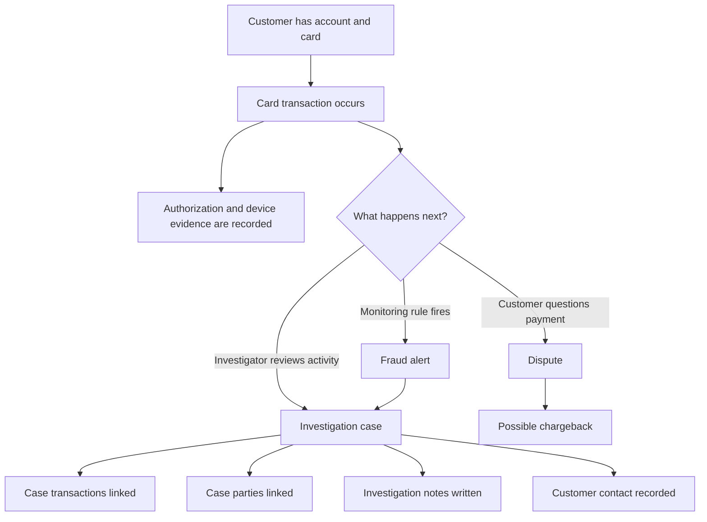
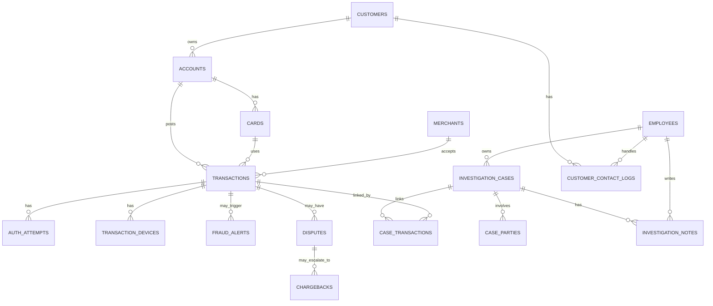

# Transaction Investigation Mock Data

This document describes the synthetic source data used by the Transaction
Investigation pipeline. It has two parts:

1. [Mock data source generation and business logic](#part-1-mock-data-source-generation-and-business-logic)
2. [Source-to-Silver data contracts](#part-2-source-to-silver-data-contracts)


## Part 1: Mock data source generation and business logic

### 1. Business context

This mock data represents a bank transaction investigation process. The goal is
to give the Bronze and Silver pipeline realistic source files to ingest, clean,
validate, and join.

The business story is:

1. A customer owns one or more bank accounts.
2. An account can have one or more cards.
3. A card is used to make transactions with merchants.
4. A transaction may have supporting evidence, such as an authorization attempt
   or device information.
5. A transaction may raise a fraud alert, become a customer dispute, or be
   linked to an investigation case.
6. Investigators review cases, link related transactions and parties, write
   notes, and record customer contacts.
7. Some disputes may become chargebacks. A chargeback is the card-scheme
   process where the bank tries to recover money from the merchant side.

The data is synthetic. It does not represent real customers, real cards, or a
complete regulatory workflow. It is only designed to test data engineering
logic: ingestion, joins, type casting, masking, data quality checks, quarantine,
and simple history handling.

Important business terms:

| Term | Simple meaning in this mock data |
|---|---|
| Authorization attempt | The system check that approves or declines a card payment. |
| Fraud alert | A warning produced by a monitoring rule, such as unusual location or high-risk behavior. |
| Dispute | A customer says a transaction is wrong or unauthorized. |
| Chargeback | A later dispute step where the bank uses card-scheme rules to recover funds. |
| Investigation case | An internal case opened for an investigator to review transactions, people, merchants, notes, and evidence. |
| Legal hold | A restricted case flag. In this project, it means the record must not be exposed to AI output. |
| PAN | Primary Account Number. In simple terms, the card number. The mock uses synthetic PANs only. |
| Bronze | The raw landing layer where source CSV values arrive first. |
| Silver | The cleaned and validated layer used after Bronze. |
| Quarantine | A holding area for records that fail data quality rules. |
| SCD Type 2 | A way to keep history when a dimension changes, such as a customer address changing over time. ( Although the mock data includes SCD2-style changes, Silver uses SCD Type 1 for this use case: it keeps only the latest valid version of each customer, card, and merchant record.)|

### 2. Business flow represented by the data



This diagram explains the business idea. The code does not generate a perfect
step-by-step timeline. Most tables are generated as source extracts, meaning
they look like current records from upstream systems.

### 3. How the tables connect

The mock data is generated in parent-to-child order. A parent table is created
first so child tables can reuse its IDs.



The main path is:

```text
customers -> accounts -> cards -> transactions
```

After transactions exist, the generator creates evidence and investigation
tables:

```text
transactions -> auth_attempts
transactions -> transaction_devices
transactions -> fraud_alerts
transactions -> disputes -> chargebacks
investigation_cases <-> case_transactions <-> transactions
investigation_cases -> investigation_notes
investigation_cases -> case_parties
customers -> customer_contact_logs
```

One important design choice: cases and disputes are not directly linked. A
dispute has a `transaction_id`. A case links to transactions through
`case_transactions`. Therefore, a case and a dispute are related only when they
share the same transaction. Do not assume every dispute has a case, or every
case has a dispute.

### 4. How the mock data is created

The generator lives in `mock/`. The local command is:

```powershell
python -m mock.generate
```

For Databricks, `generate_mock_databricks.py` calls the same generator and
publishes the CSV files into the Bronze landing volume.

The generator follows this simple pattern:

1. Read configuration from `mock/config.py`.
2. Create a seeded Faker object for names, addresses, emails, companies, and IP
   addresses.
3. Create a seeded random number generator for repeatable choices.
4. Generate reference tables first, such as countries, currencies, channels,
   reason codes, and case status values.
5. Generate business parent tables: customers, employees, accounts, cards, and
   merchants.
6. Store generated IDs in memory so later tables can point to real parent
   records.
7. Generate transaction and investigation tables using those stored IDs.
8. Inject known bad records for data quality testing.
9. Write one CSV file per table.
10. Write `defects_manifest.csv`, which lists every intentionally injected bad
    record.

Because the generator uses fixed seeds, the same inputs produce the same output.
The default seed is `42`. The pinned business date is `2026-07-06`, so "future"
and "stale" checks are measured from that date, not from the day the code runs.

### 5. Dataset size and generation order

The default baseline is large enough to test a real pipeline:

| Dataset | Default size logic |
|---|---:|
| `customers` | 5,000 |
| `employees` | 200 |
| `merchants` | 2,000 |
| `transactions` | 2,000,000 |
| `accounts` | about 1.5 accounts per customer |
| `cards` | about 1.2 cards per account |
| `auth_attempts` | about 1.2 per transaction |
| `transaction_devices` | about 0.8 per transaction |
| `disputes` | about 2% of transactions |
| `chargebacks` | about 20% of disputes |
| `fraud_alerts` | about 0.5% of transactions |
| `investigation_cases` | about 0.1% of transactions, minimum 5 |
| `investigation_notes` | about 5 notes per case |
| `case_transactions` | about 3 linked transactions per case |
| `case_parties` | about 2 parties per case |
| `customer_contact_logs` | about 1 per case |
| `date_dim` | every day from `2023-01-01` to `2030-12-31` |

Duplicate test records can add extra physical rows, so a CSV can contain more
rows than the target count.

The generation order matters:

1. Reference tables and calendar
2. Customers and employees
3. Accounts, cards, and merchants
4. Transactions, authorization attempts, and devices
5. Disputes, chargebacks, and fraud alerts
6. Investigation cases, notes, parties, transaction links, and contact logs

This is why the normal data usually joins correctly. For example, transactions
can use real card IDs because cards were already generated.

### 6. Normal business logic used by the generator

The generator creates clean rows first.

| Area | Logic used |
|---|---|
| Customers | Creates synthetic Australian-style customer details, including name, date of birth, email, phone, address, and tax ID. |
| Accounts | Assigns each account to an existing customer. Most accounts are active and use AUD. |
| Cards | Assigns each card to an existing account. Cards have a type, PAN, expiry, status, and effective date. |
| Merchants | Creates synthetic merchants with category, country, risk rating, and status. |
| Transactions | Chooses a card, uses that card's account, chooses a merchant, channel, amount, currency, timestamp, and status. |
| Authorization attempts | Links to sampled transactions and records whether the payment was approved or declined. |
| Devices | Links to sampled transactions and records device type, IP address, and country. |
| Disputes | Links to sampled transactions and records reason, amount, status, and raised date. |
| Chargebacks | Links to disputes and records scheme, amount, stage, and processed date. |
| Fraud alerts | Links to sampled transactions and records rule name, score, time, and disposition. |
| Investigation cases | Creates cases with priority, status, fraud type, owner, dates, and legal-hold flag. |
| Notes | Links notes to cases and employees. |
| Case parties | Links cases to customers, merchants, or synthetic third parties. |
| Contact logs | Links customers and employees to contact activity. |

Some fields are intentionally independent to keep the mock simple. For example,
a dispute amount does not have to equal the transaction amount. A fraud alert is
not guaranteed to create a case. A chargeback stage is only the current stage,
not a full stage-by-stage history.

### 7. Data quality test logic

After clean rows are created, the generator deliberately changes some rows into
bad rows. This is done so the Silver layer can prove it catches and quarantines
bad data.

The default defect rate is `0.05`, or 5%. The actual count varies by rule
because each defect type has its own weight. Examples of injected issues are:

| Area | Example intentional issue |
|---|---|
| Customers | Missing email, duplicate customer ID, near-duplicate customer identity. |
| Employees | Duplicate employee email and near-duplicate employee name. |
| Accounts | Account points to a customer ID that does not exist, or has a future open date. |
| Cards | Active card is already expired, or card ID is duplicated. |
| Merchants | Risk rating has invalid casing, such as `HIGH` instead of `high`. |
| Transactions | Negative amount, missing merchant, duplicate transaction ID, future timestamp, closed card, or account/card IDs that do not exist. |
| Authorization attempts | Authorization points to a transaction that does not exist, or has an invalid time. |
| Devices | Device record points to a transaction that does not exist, or is missing device type. |
| Disputes | Dispute points to a transaction that does not exist, has invalid status casing, or is missing a reason code. |
| Chargebacks | Chargeback points to a dispute that does not exist. |
| Fraud alerts | Alert score is outside the expected range. |
| Investigation cases | Case has invalid status, is stale, or has `legal_hold=true`. |
| Notes and contact logs | Free text contains synthetic sensitive data that should be masked or blocked. |
| Case links and parties | Link points to a transaction that does not exist, or party type/party ID does not resolve correctly. |

Every injected issue is logged in `defects_manifest.csv`:

```text
source_table, record_key, rule_id, rule_name, failure_reason, severity
```

This manifest is the expected-answer file for data quality testing. If the
generator says a transaction has a negative amount, the Silver quarantine logic
should catch that same transaction.

The manifest records injected issues, not every possible issue that random data
might naturally create. One source row can also have more than one defect.

### 8. Transaction sampling and large files

Transactions can reach 2 million rows, so the generator does not keep every
transaction in memory for later joins. It writes large tables as streams and
keeps a sample of transaction IDs and timestamps.

Later tables such as disputes, alerts, devices, authorization attempts, and
case links choose from this retained transaction sample. This keeps generation
fast and memory-bounded, while still giving child tables realistic transaction
references.

### 9. SCD Type 2 snapshot logic

SCD Type 2 means keeping history when an important descriptive record changes.
In this mock data, only three dimensions have this history behavior:

| Table | What can change | Business meaning |
|---|---|---|
| `customers` | `address` | Customer moved. |
| `cards` | `status` | Card lifecycle changed, such as active to blocked. |
| `merchants` | `risk_rating` | Merchant risk was reassessed. |

With `--snapshots 2` or more, the generator creates complete snapshot folders:

```text
snapshot_T0
snapshot_T1
snapshot_T2
```

Each later snapshot starts as a copy of the previous snapshot. Then the
generator changes a small number of clean customer, card, and merchant rows and
updates their `effective_at` date. Defective rows are excluded from SCD changes
so the data quality manifest and the SCD history manifest do not describe the
same problem.

SCD changes are written to `scd_changes_manifest.csv`. This file is the
expected-answer file for history testing, similar to how `defects_manifest.csv`
is the expected-answer file for data quality testing.

### 10. Databricks generation

`generate_mock_databricks.py` runs the same generator inside Databricks and
writes the result to:

```text
/Volumes/<catalog>/bronze/raw_data
```

On the first batch, it generates new mock data. On later batches, it restores
the previous batch and applies SCD changes. This means later batches are
complete source extracts with small customer, card, and merchant changes.

Files are staged first and only published after generation succeeds. Published
files use one batch number across all tables, for example:

```text
customers/customer01.csv
transactions/transaction01.csv
defects_manifest/defects_manifest01.csv
```

For later batches, the notebook also repairs transaction account links so the
card remains the main source for which account owns the transaction. Unknown
cards are left unchanged because they are intentional data quality test cases.

### 11. Important limitations

- The data is synthetic and does not represent real customers, accounts, cards,
  merchants, employees, or investigations.
- The records are source-style extracts, not a complete event-by-event process
  history.
- Cases and disputes do not have a direct key relationship.
- A fraud alert is not guaranteed to create a case.
- A disputed transaction is not guaranteed to have a chargeback.
- Dispute amounts, chargeback amounts, and transaction amounts are generated
  independently.
- `legal_hold` is a project restriction flag, not a full legal workflow.
- Synthetic names, addresses, emails, phones, tax IDs, PANs, notes, and IP
  addresses are treated as sensitive so masking and redaction can be tested.
- The business context explains why the tables exist. It does not claim the mock
  process fully complies with payment, AML, or card-scheme rules.

## Part 2: Source-to-Silver data contracts

### 12. How to read the contracts

There is one YAML contract per generated domain CSV under
`docs/contracts/sources`. `mock.config.TABLE_SCHEMAS` is the source of truth for
physical CSV column order, and the YAML files define the Source-to-Silver
contract. Raw values land in Bronze as strings. Silver performs type coercion,
validation, masking, and quarantine routing.

All contracts below have schema version `1.0.0`, layer `source_to_silver`,
contractual type layer `silver`, default failure disposition `quarantined`, and
failure destination `silver.quarantine_records`.

Conventions:

- **PK** is taken from the YAML `primary_key`.
- **FK** is shown only when the YAML field declares `references`.
- **—** means the YAML does not declare a reference, accepted-value list, or DQ
  rule for that field.
- Examples and even awkward grain wording are reproduced from the YAML rather
  than silently corrected here.
- Classification describes sensitivity and handling, not a data type.

### 13. Contract index

| Business area | Contracts |
|---|---|
| Customer and payment instrument | [customers](#customers), [accounts](#accounts), [cards](#cards) |
| Merchant and reference | [merchants](#merchants), [merchant_categories](#merchant_categories), [countries](#countries), [currencies](#currencies), [channels](#channels), [branches](#branches), [date_dim](#date_dim) |
| Transaction evidence | [transactions](#transactions), [auth_attempts](#auth_attempts), [transaction_devices](#transaction_devices) |
| Dispute and chargeback | [disputes](#disputes), [dispute_reason_codes](#dispute_reason_codes), [chargebacks](#chargebacks) |
| Investigation | [fraud_alerts](#fraud_alerts), [fraud_types](#fraud_types), [investigation_cases](#investigation_cases), [case_status_types](#case_status_types), [employees](#employees), [investigation_notes](#investigation_notes), [case_transactions](#case_transactions), [case_parties](#case_parties), [customer_contact_logs](#customer_contact_logs) |

### customers

Source: `data/raw/customers.csv`  
Purpose: Mock source dataset for customers.  
Grain: one row per customer  
Primary key: `customer_id`

| Field | Type | Required | Key / reference | Accepted values | Classification | DQ rules | Example |
|---|---|---:|---|---|---|---|---|
| `customer_id` | string | yes | PK | — | internal | `DQ-CUST-ID-DUP`, `DQ-CUST-NEAR-DUP` | `CUST-0001` |
| `first_name` | string | yes | — | — | direct_identifier | — | `example` |
| `last_name` | string | yes | — | — | direct_identifier | — | `example` |
| `dob` | date | yes | — | — | sensitive | `DQ-CUST-DOB-TYPE` | `2026-07-06` |
| `email` | string | no | — | — | contact | `DQ-CUST-EMAIL-FMT` | `example` |
| `phone` | string | no | — | — | contact | — | `example` |
| `address` | string | no | — | — | sensitive | — | `example` |
| `tax_id` | string | no | — | — | sensitive | — | `example` |
| `created_at` | timestamp | yes | — | — | internal | `DQ-CUST-CREATED-TYPE` | `2026-07-06T10:00:00Z` |
| `effective_at` | timestamp | yes | — | — | internal | — | `2026-07-06T10:00:00Z` |

### accounts

Source: `data/raw/accounts.csv`  
Purpose: Mock source dataset for accounts.  
Grain: one row per account  
Primary key: `account_id`

| Field | Type | Required | Key / reference | Accepted values | Classification | DQ rules | Example |
|---|---|---:|---|---|---|---|---|
| `account_id` | string | yes | PK | — | internal | — | `ACC-0001` |
| `customer_id` | string | yes | FK → `customers.customer_id` | — | internal | `DQ-ACC-CUST-FK` | `CUST-0001` |
| `product_type` | string | yes | — | `Everyday`, `Savings`, `Credit`, `Debit` | internal | — | `Everyday` |
| `open_date` | date | yes | — | — | internal | `DQ-ACC-OPENDATE-FUTURE`, `DQ-ACC-OPENDATE-TYPE` | `2026-07-06` |
| `status` | string | yes | — | `active`, `dormant`, `closed`, `frozen` | internal | — | `active` |
| `currency` | string | yes | — | — | internal | — | `example` |

### cards

Source: `data/raw/cards.csv`  
Purpose: Mock source dataset for cards.  
Grain: one row per card  
Primary key: `card_id`

| Field | Type | Required | Key / reference | Accepted values | Classification | DQ rules | Example |
|---|---|---:|---|---|---|---|---|
| `card_id` | string | yes | PK | — | internal | `DQ-CARD-DUP` | `CARD-0001` |
| `account_id` | string | yes | FK → `accounts.account_id` | — | internal | `DQ-CARD-ACCT-FK` | `ACC-0001` |
| `card_type` | string | yes | — | `debit`, `credit` | internal | — | `debit` |
| `pan` | string | yes | — | — | payment_card | — | `example` |
| `expiry` | string | yes | — | — | internal | `DQ-CARD-EXPIRED-ACTIVE` | `example` |
| `status` | string | yes | — | `active`, `blocked`, `expired`, `closed` | internal | — | `active` |
| `effective_at` | timestamp | yes | — | — | internal | — | `2026-07-06T10:00:00Z` |

### merchants

Source: `data/raw/merchants.csv`  
Purpose: Mock source dataset for merchants.  
Grain: one row per merchant  
Primary key: `merchant_id`

| Field | Type | Required | Key / reference | Accepted values | Classification | DQ rules | Example |
|---|---|---:|---|---|---|---|---|
| `merchant_id` | string | yes | PK | — | internal | — | `MCH-0001` |
| `name` | string | yes | — | — | internal | — | `example` |
| `mcc` | string | yes | FK → `merchant_categories.mcc` | — | internal | — | `example` |
| `country` | string | yes | FK → `countries.iso_code` | — | internal | — | `example` |
| `risk_rating` | string | yes | — | `low`, `medium`, `high` | internal | `DQ-MERCH-RISK-CASING` | `low` |
| `status` | string | yes | — | `active`, `suspended`, `closed` | internal | — | `active` |
| `effective_at` | timestamp | yes | — | — | internal | `DQ-MERCH-EFFECTIVE-TYPE` | `2026-07-06T10:00:00Z` |

### merchant_categories

Source: `data/raw/merchant_categories.csv`  
Purpose: Mock source dataset for merchant categories.  
Grain: one row per merchant_categorie  
Primary key: `mcc`

| Field | Type | Required | Key / reference | Accepted values | Classification | DQ rules | Example |
|---|---|---:|---|---|---|---|---|
| `mcc` | string | yes | PK | — | internal | — | `example` |
| `category_name` | string | yes | — | — | internal | — | `example` |
| `category_group` | string | yes | — | — | internal | — | `example` |

### countries

Source: `data/raw/countries.csv`  
Purpose: Mock source dataset for countries.  
Grain: one row per countrie  
Primary key: `iso_code`

| Field | Type | Required | Key / reference | Accepted values | Classification | DQ rules | Example |
|---|---|---:|---|---|---|---|---|
| `iso_code` | string | yes | PK | — | internal | — | `example` |
| `name` | string | yes | — | — | internal | — | `example` |
| `region` | string | yes | — | — | internal | — | `example` |

### currencies

Source: `data/raw/currencies.csv`  
Purpose: Mock source dataset for currencies.  
Grain: one row per currencie  
Primary key: `currency_code`

| Field | Type | Required | Key / reference | Accepted values | Classification | DQ rules | Example |
|---|---|---:|---|---|---|---|---|
| `currency_code` | string | yes | PK | — | internal | — | `example` |
| `name` | string | yes | — | — | internal | — | `example` |
| `decimals` | integer | yes | — | — | internal | `DQ-CURR-DECIMALS-TYPE` | `2` |

### channels

Source: `data/raw/channels.csv`  
Purpose: Mock source dataset for channels.  
Grain: one row per channel  
Primary key: `channel_code`

| Field | Type | Required | Key / reference | Accepted values | Classification | DQ rules | Example |
|---|---|---:|---|---|---|---|---|
| `channel_code` | string | yes | PK | — | internal | — | `example` |
| `channel_name` | string | yes | — | — | internal | — | `example` |

### branches

Source: `data/raw/branches.csv`  
Purpose: Mock source dataset for branches.  
Grain: one row per branche  
Primary key: `branch_code`

| Field | Type | Required | Key / reference | Accepted values | Classification | DQ rules | Example |
|---|---|---:|---|---|---|---|---|
| `branch_code` | string | yes | PK | — | internal | — | `BR-01` |
| `name` | string | yes | — | — | internal | — | `example` |
| `country` | string | yes | FK → `countries.iso_code` | — | internal | — | `example` |
| `region` | string | yes | — | — | internal | — | `example` |
| `status` | string | yes | — | — | internal | — | `example` |

### date_dim

Source: `data/raw/date_dim.csv`  
Purpose: Mock source dataset for date dim.  
Grain: one row per calendar day  
Primary key: `date_id`

| Field | Type | Required | Key / reference | Accepted values | Classification | DQ rules | Example |
|---|---|---:|---|---|---|---|---|
| `date_id` | date | yes | PK | — | internal | `DQ-DATE-ID-TYPE` | `20260706` |
| `year` | integer | yes | — | — | internal | `DQ-DATE-YEAR-TYPE` | `2` |
| `month` | integer | yes | — | — | internal | `DQ-DATE-MONTH-TYPE` | `2` |
| `quarter` | integer | yes | — | — | internal | `DQ-DATE-QUARTER-TYPE` | `2` |
| `is_weekend` | boolean | yes | — | — | internal | `DQ-DATE-WEEKEND-TYPE` | `true` |

### transactions

Source: `data/raw/transactions.csv`  
Purpose: Mock source dataset for transactions.  
Grain: one row per transaction  
Primary key: `transaction_id`

| Field | Type | Required | Key / reference | Accepted values | Classification | DQ rules | Example |
|---|---|---:|---|---|---|---|---|
| `transaction_id` | string | yes | PK | — | internal | `DQ-TXN-ID-DUP` | `TXN-000001` |
| `account_id` | string | yes | FK → `accounts.account_id` | — | internal | `DQ-TXN-ACCT-FK` | `ACC-0001` |
| `card_id` | string | yes | FK → `cards.card_id` | — | internal | `DQ-TXN-CARD-ACTIVE`, `DQ-TXN-CARD-FK` | `CARD-0001` |
| `merchant_id` | string | yes | FK → `merchants.merchant_id` | — | internal | `DQ-TXN-MERCH-REQ`, `DQ-TXN-MERCH-FK` | `MCH-0001` |
| `channel` | string | yes | FK → `channels.channel_code` | — | internal | — | `example` |
| `amount` | decimal(18,2) | yes | — | — | internal | `DQ-TXN-AMT-POS`, `DQ-TXN-AMOUNT-TYPE` | `100.00` |
| `currency` | string | yes | FK → `currencies.currency_code` | — | internal | — | `example` |
| `txn_ts` | timestamp | yes | — | — | internal | `DQ-TXN-TS-FUTURE`, `DQ-TXN-TS-TYPE` | `2026-07-06T10:00:00Z` |
| `status` | string | yes | — | `authorized`, `settled`, `declined`, `reversed`, `refunded` | internal | — | `authorized` |

### auth_attempts

Source: `data/raw/auth_attempts.csv`  
Purpose: Mock source dataset for auth attempts.  
Grain: one row per auth_attempt  
Primary key: `attempt_id`

| Field | Type | Required | Key / reference | Accepted values | Classification | DQ rules | Example |
|---|---|---:|---|---|---|---|---|
| `attempt_id` | string | yes | PK | — | internal | — | `AUTH-000001` |
| `transaction_id` | string | yes | FK → `transactions.transaction_id` | — | internal | `DQ-AUTH-TXN-FK` | `TXN-000001` |
| `decision` | string | yes | — | `approved`, `declined` | internal | — | `approved` |
| `decline_reason` | string | no | — | — | internal | — | `example` |
| `auth_ts` | string | yes | — | — | internal | `DQ-AUTH-TS-ORDER`, `DQ-AUTH-TS-TYPE` | `example` |

### transaction_devices

Source: `data/raw/transaction_devices.csv`  
Purpose: Mock source dataset for transaction devices.  
Grain: one row per transaction_device  
Primary key: `device_id`

| Field | Type | Required | Key / reference | Accepted values | Classification | DQ rules | Example |
|---|---|---:|---|---|---|---|---|
| `device_id` | string | yes | PK | — | device_identifier | — | `DEV-000001` |
| `transaction_id` | string | yes | FK → `transactions.transaction_id` | — | internal | `DQ-DEV-TXN-FK` | `TXN-000001` |
| `device_type` | string | yes | — | — | internal | `DQ-DEV-TYPE-REQ` | `example` |
| `ip` | string | yes | — | — | network_identifier | — | `example` |
| `geo_country` | string | yes | FK → `countries.iso_code` | — | internal | — | `example` |

### disputes

Source: `data/raw/disputes.csv`  
Purpose: Mock source dataset for disputes.  
Grain: one row per dispute  
Primary key: `dispute_id`

| Field | Type | Required | Key / reference | Accepted values | Classification | DQ rules | Example |
|---|---|---:|---|---|---|---|---|
| `dispute_id` | string | yes | PK | — | internal | — | `DSP-0001` |
| `transaction_id` | string | yes | FK → `transactions.transaction_id` | — | internal | `DQ-DISP-TXN-FK` | `TXN-000001` |
| `reason_code` | string | yes | FK → `dispute_reason_codes.reason_code` | — | internal | `DQ-DISP-REASON-REQ` | `example` |
| `amount` | decimal(18,2) | yes | — | — | internal | `DQ-DISP-AMOUNT-TYPE` | `100.00` |
| `status` | string | yes | — | `open`, `in_review`, `resolved`, `rejected`, `withdrawn` | internal | `DQ-DISP-STATUS-ENUM` | `open` |
| `raised_at` | timestamp | yes | — | — | internal | `DQ-DISP-RAISED-TYPE` | `2026-07-06T10:00:00Z` |

### dispute_reason_codes

Source: `data/raw/dispute_reason_codes.csv`  
Purpose: Mock source dataset for dispute reason codes.  
Grain: one row per dispute_reason_code  
Primary key: `reason_code`

| Field | Type | Required | Key / reference | Accepted values | Classification | DQ rules | Example |
|---|---|---:|---|---|---|---|---|
| `reason_code` | string | yes | PK | — | internal | — | `example` |
| `description` | string | yes | — | — | internal | — | `example` |

### chargebacks

Source: `data/raw/chargebacks.csv`  
Purpose: Mock source dataset for chargebacks.  
Grain: one row per chargeback  
Primary key: `chargeback_id`

| Field | Type | Required | Key / reference | Accepted values | Classification | DQ rules | Example |
|---|---|---:|---|---|---|---|---|
| `chargeback_id` | string | yes | PK | — | internal | — | `CBK-0001` |
| `dispute_id` | string | yes | FK → `disputes.dispute_id` | — | internal | `DQ-CBK-DISP-FK` | `DSP-0001` |
| `scheme` | string | yes | — | — | internal | — | `example` |
| `amount` | decimal(18,2) | yes | — | — | internal | `DQ-CBK-AMOUNT-TYPE` | `100.00` |
| `stage` | string | yes | — | — | internal | — | `example` |
| `processed_at` | timestamp | yes | — | — | internal | `DQ-CBK-PROCESSED-TYPE` | `2026-07-06T10:00:00Z` |

### fraud_alerts

Source: `data/raw/fraud_alerts.csv`  
Purpose: Mock source dataset for fraud alerts.  
Grain: one row per fraud_alert  
Primary key: `alert_id`

| Field | Type | Required | Key / reference | Accepted values | Classification | DQ rules | Example |
|---|---|---:|---|---|---|---|---|
| `alert_id` | string | yes | PK | — | internal | — | `ALT-0001` |
| `transaction_id` | string | yes | FK → `transactions.transaction_id` | — | internal | `DQ-ALT-TXN-FK` | `TXN-000001` |
| `rule_name` | string | yes | — | — | internal | — | `example` |
| `score` | double | yes | — | — | internal | `DQ-ALT-SCORE-RANGE`, `DQ-ALT-SCORE-TYPE` | `0.85` |
| `triggered_at` | timestamp | yes | — | — | internal | `DQ-ALT-TRIGGERED-TYPE` | `2026-07-06T10:00:00Z` |
| `disposition` | string | yes | — | `open`, `escalated_to_case`, `dismissed`, `true_positive`, `false_positive` | internal | — | `open` |

### fraud_types

Source: `data/raw/fraud_types.csv`  
Purpose: Mock source dataset for fraud types.  
Grain: one row per fraud_type  
Primary key: `fraud_type_code`

| Field | Type | Required | Key / reference | Accepted values | Classification | DQ rules | Example |
|---|---|---:|---|---|---|---|---|
| `fraud_type_code` | string | yes | PK | — | internal | — | `example` |
| `description` | string | yes | — | — | internal | — | `example` |
| `severity` | string | yes | — | — | internal | — | `example` |

### investigation_cases

Source: `data/raw/investigation_cases.csv`  
Purpose: Mock source dataset for investigation cases.  
Grain: one row per investigation_case  
Primary key: `case_id`

| Field | Type | Required | Key / reference | Accepted values | Classification | DQ rules | Example |
|---|---|---:|---|---|---|---|---|
| `case_id` | string | yes | PK | — | internal | — | `CASE-0001` |
| `priority` | string | yes | — | `low`, `medium`, `high`, `critical` | internal | — | `low` |
| `status_code` | string | yes | FK → `case_status_types.status_code` | — | internal | `DQ-CASE-STATUS-ENUM` | `example` |
| `fraud_type_code` | string | yes | FK → `fraud_types.fraud_type_code` | — | internal | — | `example` |
| `owner_employee_id` | string | yes | FK → `employees.employee_id` | — | internal | — | `example` |
| `opened_at` | timestamp | yes | — | — | internal | `DQ-CASE-STALE`, `DQ-CASE-OPENED-TYPE` | `2026-07-06T10:00:00Z` |
| `closed_at` | timestamp | no | — | — | internal | `DQ-CASE-CLOSED-TYPE` | `2026-07-06T10:00:00Z` |
| `legal_hold` | boolean | yes | — | — | restricted | `DQ-CASE-LEGALHOLD`, `DQ-CASE-LEGALHOLD-TYPE` | `true` |

### case_status_types

Source: `data/raw/case_status_types.csv`  
Purpose: Mock source dataset for case status types.  
Grain: one row per case_status_type  
Primary key: `status_code`

| Field | Type | Required | Key / reference | Accepted values | Classification | DQ rules | Example |
|---|---|---:|---|---|---|---|---|
| `status_code` | string | yes | PK | — | internal | — | `example` |
| `description` | string | yes | — | — | internal | — | `example` |

### employees

Source: `data/raw/employees.csv`  
Purpose: Mock source dataset for employees.  
Grain: one row per employee  
Primary key: `employee_id`

| Field | Type | Required | Key / reference | Accepted values | Classification | DQ rules | Example |
|---|---|---:|---|---|---|---|---|
| `employee_id` | string | yes | PK | — | internal | — | `EMP-0001` |
| `full_name` | string | yes | — | — | staff_identifier | — | `example` |
| `email` | string | yes | — | — | staff_identifier | — | `example` |
| `team` | string | yes | — | — | internal | — | `example` |
| `role` | string | yes | — | — | internal | — | `example` |

### investigation_notes

Source: `data/raw/investigation_notes.csv`  
Purpose: Mock source dataset for investigation notes.  
Grain: one row per investigation_note  
Primary key: `note_id`

| Field | Type | Required | Key / reference | Accepted values | Classification | DQ rules | Example |
|---|---|---:|---|---|---|---|---|
| `note_id` | string | yes | PK | — | internal | — | `NOTE-0001` |
| `case_id` | string | yes | FK → `investigation_cases.case_id` | — | internal | `DQ-NOTE-CASE-FK` | `CASE-0001` |
| `author_employee_id` | string | yes | FK → `employees.employee_id` | — | internal | `DQ-NOTE-EMP-FK` | `example` |
| `note_text` | string | yes | — | — | sensitive_free_text | `DQ-NOTE-PII-LEAK` | `example` |
| `created_at` | timestamp | yes | — | — | internal | `DQ-NOTE-CREATED-TYPE` | `2026-07-06T10:00:00Z` |

### case_transactions

Source: `data/raw/case_transactions.csv`  
Purpose: Mock source dataset for case transactions.  
Grain: one row per case-to-transaction link  
Primary key: `case_id`, `transaction_id`

| Field | Type | Required | Key / reference | Accepted values | Classification | DQ rules | Example |
|---|---|---:|---|---|---|---|---|
| `case_id` | string | yes | PK; FK → `investigation_cases.case_id` | — | internal | `DQ-CASETXN-CASE-FK` | `CASE-0001` |
| `transaction_id` | string | yes | PK; FK → `transactions.transaction_id` | — | internal | `DQ-CASETXN-TXN-FK` | `TXN-000001` |
| `linked_at` | timestamp | yes | — | — | internal | `DQ-CASETXN-LINKED-TYPE` | `2026-07-06T10:00:00Z` |

### case_parties

Source: `data/raw/case_parties.csv`  
Purpose: Mock source dataset for case parties.  
Grain: one row per case-to-party link  
Primary key: `case_id`, `party_type`, `party_id`

| Field | Type | Required | Key / reference | Accepted values | Classification | DQ rules | Example |
|---|---|---:|---|---|---|---|---|
| `case_id` | string | yes | PK; FK → `investigation_cases.case_id` | — | internal | `DQ-CASEPARTY-CASE-FK` | `CASE-0001` |
| `party_type` | string | yes | PK | `customer`, `merchant`, `third_party` | internal | `DQ-CASEPARTY-TYPE-ENUM` | `customer` |
| `party_id` | string | yes | PK | — | internal | `DQ-CASEPARTY-RESOLVE` | `example` |
| `role` | string | yes | — | `subject`, `reporter`, `witness`, `merchant` | internal | — | `subject` |

`party_id` has a conditional relationship implemented by the DQ rule rather
than a single YAML `references` value: customer IDs resolve to `customers`,
merchant IDs resolve to `merchants`, and third-party IDs are synthetic.

### customer_contact_logs

Source: `data/raw/customer_contact_logs.csv`  
Purpose: Mock source dataset for customer contact logs.  
Grain: one row per customer_contact_log  
Primary key: `contact_id`

| Field | Type | Required | Key / reference | Accepted values | Classification | DQ rules | Example |
|---|---|---:|---|---|---|---|---|
| `contact_id` | string | yes | PK | — | internal | — | `CTL-0001` |
| `customer_id` | string | yes | FK → `customers.customer_id` | — | internal | `DQ-CTL-CUST-FK` | `CUST-0001` |
| `direction` | string | yes | — | `inbound`, `outbound` | internal | — | `inbound` |
| `contact_method` | string | yes | — | `phone`, `email`, `sms`, `post` | internal | — | `phone` |
| `do_not_contact` | boolean | yes | — | — | internal | `DQ-CTL-DNC-TYPE`, `DQ-CTL-DNC-VIOLATION` | `true` |
| `contacted_at` | timestamp | yes | — | — | internal | `DQ-CTL-CONTACTED-TYPE` | `2026-07-06T10:00:00Z` |
| `employee_id` | string | yes | FK → `employees.employee_id` | — | internal | `DQ-CTL-EMP-FK` | `EMP-0001` |
| `note` | string | yes | — | — | sensitive_free_text | `DQ-CTL-NOTE-PII` | `example` |

### 14. Contract ownership and validation

The contract tables above are a human-readable view; the YAML files remain the
machine-readable source of truth. Contract drift is checked with:

```powershell
python -m unittest tests.test_source_contracts
```

That test verifies:

- every table in `mock.config.TABLE_SCHEMAS` has exactly one YAML contract;
- the dataset and source path match the filename;
- grain and primary key are present;
- fields appear in the physical CSV-header order; and
- every declared DQ rule exists in the executable DQ registry.

Gold and AI-output contracts are separately versioned under
`docs/models/gold`; they are outside this source-contract scope.
