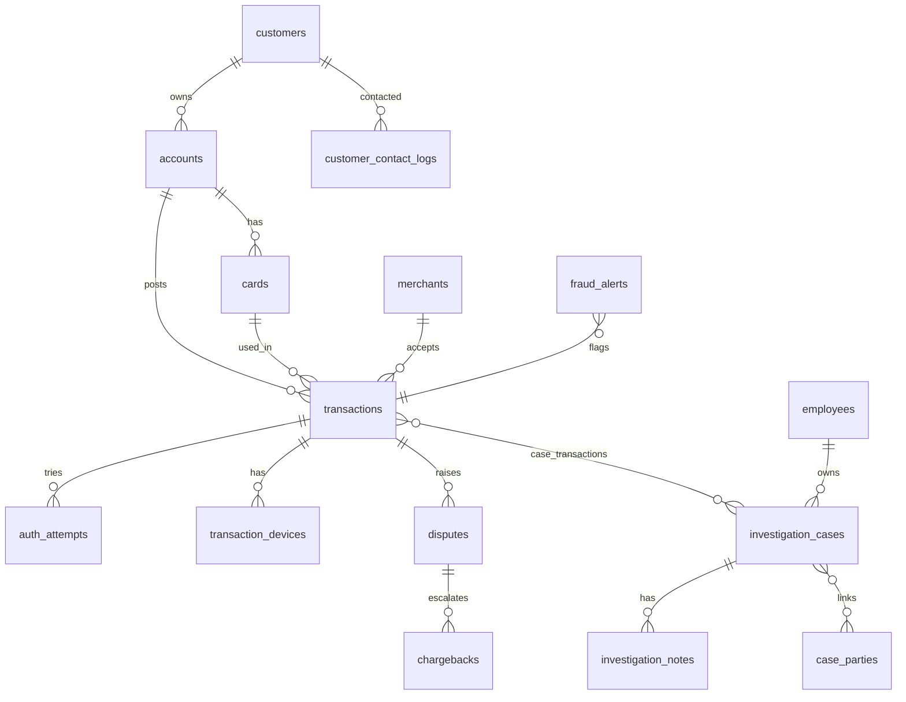

# Mock Data Model & Contracts — Transaction Investigation Context

> **AI-Ready Context** artifact + team data spec.
> **Scenario:** Banking Transaction Investigation — transactions, disputes/chargebacks, merchants, fraud alerts, investigator notes.
> **Target:** 20–30 source tables with **intentional DQ defects** for the Zero-Trust-AI pipeline to catch.
> **Status (CTA 10):** contracts finalized — Bronze source files may now be generated **exactly** per §4. Naming, enums, PII, quarantine, and Gold grain are all resolved below.

## 0. Conventions

- **Naming (CTA 1): plural** everywhere — `customers`, `accounts`, `transactions`, … Reference/lookup tables plural (`channels`, `countries`); calendar dimension kept as `date_dim` by convention. Governance tables plural: `dq_rules`, `dq_results`, `quarantine_records`, `pipeline_runs`, `metadata_lineage`, `masking_policies`, `access_policies`.
- **Grain (CTA 5):** every table has an explicit grain (§3 + §4).
- **Bronze typing:** all source fields land as `STRING`; type coercion is Silver's job (failures → quarantine).
- **Bronze metadata (CTA 4), on every bronze table:** `_source_file`, `_source_file_mod_time`, `_ingest_ts`, `_run_id`, `_batch_id`, `_rescued_data`, plus `_source_record_id` and `_record_hash` for dedup/replay/quarantine joins. Defined in `bronze-layer.md`.
- **PII (CTA 7):** handled per layer — Bronze keeps raw, Silver masks, Gold redacts. Full matrix in §6.
- Mock PII/tax_id/PAN values are **synthetic** — no real customer/NAB data.

## 1. Domain narrative

A **customer** holds one or more **accounts**, each with one or more **cards**. Customers make **transactions** against **merchants** via a **channel** (ATM, POS, e-commerce, mobile, branch); each transaction may carry **device/session** data and one or more **auth_attempts**.

When something looks wrong, two parallel processes start:
- **disputes / chargebacks** — customer-initiated (the card scheme may issue a **chargeback**).
- **fraud_alerts → investigation_cases** — internal. An **employee** (investigator) opens a case, links the relevant **transactions** and **case_parties** (customer, merchant, third party) via **case_transactions**/**case_parties**, and writes free-text **investigation_notes**.

The pipeline ingests all of this, quarantines bad records, masks PII, and produces a curated **investigation_context** (one per case) that an AI assistant can safely retrieve.

## 2. Layer mapping

- **Mock sources (→ Bronze):** groups A–D (§3, §4). Pipeline-emitted **governance** tables (group E) evidence DQ/lineage/privacy.

## 3. Table inventory (with grain)

Legend — **PII**: 🔴 high · 🟠 medium · ⚪ none. **DQ defects** are intentional.

### A. Customers & accounts
| Table | Grain | Purpose | PII | Key defects |
|---|---|---|---|---|
| `customers` | one row per customer | Customer master | 🔴 | missing email; exact-dup `customer_id`; near-dup (name+dob+address+tax_id) |
| `accounts` | one row per account | Bank accounts | ⚪ | orphan `customer_id`; future `open_date` |
| `cards` | one row per card | Payment cards | 🔴 | raw synthetic `pan`; expired-but-active; closed |
| `customer_contact_logs` | one row per contact attempt | Contact history + DNC | 🟠 | outbound to `do_not_contact=true`; note leaking PII |

### B. Reference / dimensions
| Table | Grain | Purpose | Defects |
|---|---|---|---|
| `merchants` | one row per merchant | Merchant master | inconsistent `risk_rating` casing; closed merchant still referenced |
| `merchant_categories` | one row per MCC | MCC lookup | RI checks |
| `channels` | one row per channel | Channel lookup | casing in source |
| `branches` | one row per branch | Branch master | stale/closed |
| `countries` | one row per country | ISO country | — |
| `currencies` | one row per currency | ISO currency | — |
| `date_dim` | one row per calendar day | Calendar | — |
| `employees` | one row per employee | Investigators | 🔴 PII; duplicate emails |
| `dispute_reason_codes` | one row per reason | Dispute reasons | — |
| `case_status_types` | one row per status | Status enum | source values don't match enum |
| `fraud_types` | one row per fraud type | Fraud taxonomy | — |

### C. Events & facts (stress-test target)
| Table | Grain | Purpose | PII | Defects |
|---|---|---|---|---|
| `transactions` | one row per transaction event | Core fact (~2M/hr) | ⚪ | dup `transaction_id`; negative amount; missing `merchant_id`; orphan account+card; future `txn_ts`; closed-card use |
| `transaction_devices` | one row per transaction device | Device/session fingerprint | 🟠 | orphan `transaction_id`; null `device_type`; implausible geo |
| `auth_attempts` | one row per authorization attempt | Card auth attempts | ⚪ | `auth_ts` after `txn_ts`; missing decision |

### D. Investigation & disputes
| Table | Grain | Purpose | PII | Defects |
|---|---|---|---|---|
| `disputes` | one row per dispute | Customer disputes | ⚪ | orphan `transaction_id`; missing reason; status outside enum |
| `chargebacks` | one row per chargeback | Scheme chargebacks | ⚪ | orphan `dispute_id`; stage out of order |
| `investigation_cases` | one row per case | Fraud/SAR cases | 🟠 | stale open (>180d); status outside enum; `legal_hold` |
| `investigation_notes` | one row per note per case | Free-text notes | 🔴 | `note_text` leaking PII/PAN; notes on `legal_hold` cases |
| `fraud_alerts` | one row per alert | Rule-engine alerts | ⚪ | score out of [0,1]; duplicate alerts |
| `case_transactions` | one row per case↔txn link | Bridge | ⚪ | orphan keys |
| `case_parties` | one row per case↔party link | Bridge (conditional RI) | 🟠 | invalid `party_type`; unresolvable `party_id` |

> **Count:** A–D = **25 source tables** (satisfies 20–30). `currencies`, `branches`, `auth_attempts` are easiest to drop to trim; bridges/`transaction_devices` easiest to add weight.

### E. Governance (pipeline-emitted — not mocked)
| Table | Purpose |
|---|---|
| `dq_rules` | DQ rule catalog: `rule_id`, `layer`, `target_table`, `severity`, expression |
| `dq_results` | Per run × rule pass/fail counts + sample keys |
| `quarantine_records` | Failed rows — full schema in §7 |
| `pipeline_runs` | `run_id`, start/end, per-stage row counts, status |
| `metadata_lineage` | Source dataset/field → silver/gold field traceability |
| `masking_policies` | Per sensitive field → `mask`/`hash`/`tokenize`/`drop` (§6) |
| `access_policies` | Per field → `internal_only`/`customer_facing`/`ai_allowed` |

## 4. Data contracts (CTA 2)

Contract columns: `field | type | req/opt | accepted values or pattern | example | key | PII | quality rule`. Bronze stores all as STRING; types below are the **contractual (Silver) types**.

### 4.1 `customers` — grain: one row per customer
| field | type | req/opt | accepted / pattern | example | key | PII | quality rule |
|---|---|---|---|---|---|---|---|
| customer_id | string | req | `^CUST-\d{4}$` | CUST-1001 | PK | — | not null; unique |
| first_name | string | req | non-empty | Jane | — | direct id | not null |
| last_name | string | req | non-empty | Smith | — | direct id | not null |
| dob | date | req | yyyy-mm-dd; not future; age≥18 | 1989-03-12 | — | sensitive | valid; not future |
| email | string | opt | `^[\w.+-]+@[\w-]+\.[\w.-]+$` | jane.smith@example.com | — | contact | if present, valid format |
| phone | string | opt | `^\+\d{6,15}$` | +61412345678 | — | contact | if present, valid format |
| address | string | opt | free text | 12 King St Melbourne | — | sensitive | — |
| tax_id | string | opt | synthetic mock `^\d{9}$` | 111222333 | — | sensitive | synthetic only; masked/hashed from Silver |
| created_at | timestamp | req | ISO-8601 UTC; not future | 2023-01-15T00:00:00Z | — | — | not future |

Defects: missing email; exact-dup `customer_id`; near-dup name+dob+address+**tax_id**.

### 4.2 `accounts` — grain: one row per account
| field | type | req/opt | accepted / pattern | example | key | PII | quality rule |
|---|---|---|---|---|---|---|---|
| account_id | string | req | `^ACC-\d{4}$` | ACC-2001 | PK | — | not null; unique |
| customer_id | string | req | exists in customers | CUST-1001 | FK→customers | — | RI |
| product_type | string | req | {Everyday,Savings,Credit,Debit} | Everyday | — | — | in enum |
| open_date | date | req | not future | 2023-01-16 | — | — | not future |
| status | string | req | {active,dormant,closed,frozen} | active | — | — | in enum (§5) |
| currency | string | req | `^[A-Z]{3}$`; exists in currencies | AUD | FK→currencies | — | RI + format |

Defects: orphan `customer_id` (CUST-9999); future `open_date`.

### 4.3 `cards` — grain: one row per card
| field | type | req/opt | accepted / pattern | example | key | PII | quality rule |
|---|---|---|---|---|---|---|---|
| card_id | string | req | `^CARD-\d{4}$` | CARD-3001 | PK | — | not null; unique |
| account_id | string | req | exists in accounts | ACC-2001 | FK→accounts | — | RI |
| card_type | string | req | {debit,credit} | debit | — | — | in enum |
| pan | string | req | synthetic PAN `^\d{4}-\d{4}-\d{4}-\d{4}$` | 4532-1111-2222-3333 | — | payment | raw in Bronze; must be masked/tokenized from Silver onward |
| expiry | string | req | `^\d{4}-(0[1-9]\|1[0-2])$` | 2027-08 | — | — | format; past+active → business-rule fail |
| status | string | req | {active,blocked,expired,closed} | active | — | — | in enum (§5) |

Defects: expired-but-active; closed card. Raw synthetic PAN is expected in Bronze so masking can be implemented and tested in the pipeline.

### 4.4 `merchants` — grain: one row per merchant
| field | type | req/opt | accepted / pattern | example | key | PII | quality rule |
|---|---|---|---|---|---|---|---|
| merchant_id | string | req | `^MCH-\d{4}$` | MCH-4001 | PK | — | not null; unique |
| name | string | req | non-empty | Coffee Corner | — | — | not null |
| mcc | string | req | exists in merchant_categories | 5499 | FK→merchant_categories | — | RI |
| country | string | req | exists in countries | AU | FK→countries | — | RI |
| risk_rating | string | req | {low,medium,high} | low | — | — | in enum (Silver lowercases) |
| status | string | req | {active,suspended,closed} | active | — | — | in enum (§5) |

Defects: inconsistent casing (low/HIGH/Medium); closed merchant referenced.

### 4.5 `merchant_categories` — grain: one row per MCC
| field | type | req/opt | accepted / pattern | example | key | PII | quality rule |
|---|---|---|---|---|---|---|---|
| mcc | string | req | `^\d{4}$` | 5499 | PK | — | not null; unique |
| category_name | string | req | non-empty | Cafes & Restaurants | — | — | not null |
| category_group | string | req | {Food,Retail,Travel,Services} | Food | — | — | in enum |

### 4.6 `transactions` — grain: one row per transaction event (stress target)
| field | type | req/opt | accepted / pattern | example | key | PII | quality rule |
|---|---|---|---|---|---|---|---|
| transaction_id | string | req | `^TXN-\d{6}$` | TXN-500001 | PK | — | not null; unique |
| account_id | string | req | exists in accounts | ACC-2001 | FK→accounts | — | RI |
| card_id | string | opt | exists in cards if present | CARD-3001 | FK→cards | — | RI |
| merchant_id | string | req | exists in merchants | MCH-4001 | FK→merchants | — | RI (required) |
| channel | string | req | exists in channels | pos | FK→channels | — | RI |
| amount | decimal(12,2) | req | > 0 | 129.50 | — | — | amount > 0 |
| currency | string | req | exists in currencies | AUD | FK→currencies | — | RI |
| txn_ts | timestamp | req | ISO-8601 UTC; not future | 2026-07-05T10:14:00Z | — | — | not future |
| status | string | req | {authorized,settled,declined,reversed,refunded} | settled | — | — | in enum (§5) |

Defects: dup `transaction_id`; negative amount; missing `merchant_id`; orphan account+card; future `txn_ts`; use of closed card.

### 4.7 `disputes` — grain: one row per dispute
| field | type | req/opt | accepted / pattern | example | key | PII | quality rule |
|---|---|---|---|---|---|---|---|
| dispute_id | string | req | `^DSP-\d{4}$` | DSP-6001 | PK | — | not null; unique |
| transaction_id | string | req | exists in transactions | TXN-500001 | FK→transactions | — | RI |
| reason_code | string | req | exists in dispute_reason_codes | 10.4 | FK→dispute_reason_codes | — | RI |
| amount | decimal | req | > 0; ≈ txn amount ±tol | 129.50 | — | — | matches txn amount |
| status | string | req | {open,in_review,resolved,rejected,withdrawn} | open | — | — | in enum, lowercase (§5) |
| raised_at | timestamp | req | ISO-8601; not future; ≥ txn_ts | 2026-07-06T08:00:00Z | — | — | ≥ txn_ts |

Defects: orphan `transaction_id`; status casing `Open`; missing `reason_code`.

### 4.8 `investigation_cases` — grain: one row per case
| field | type | req/opt | accepted / pattern | example | key | PII | quality rule |
|---|---|---|---|---|---|---|---|
| case_id | string | req | `^CASE-\d{4}$` | CASE-7001 | PK | — | not null; unique |
| priority | string | req | {low,medium,high,critical} | high | — | — | in enum |
| status_code | string | req | exists in case_status_types | open | FK→case_status_types | — | RI / in enum (§5) |
| fraud_type_code | string | req | exists in fraud_types | card_fraud | FK→fraud_types | — | RI |
| owner_employee_id | string | req | exists in employees | EMP-9001 | FK→employees | — | RI |
| opened_at | timestamp | req | ISO-8601; not future | 2026-07-05T09:00:00Z | — | — | not future |
| closed_at | timestamp | opt | null if open; ≥ opened_at | (null) | — | — | if present, ≥ opened_at |
| legal_hold | boolean | req | {true,false} | false | — | — | if true → exclude from Gold/AI |

Defects: stale open (>180d); `status_code` `on_hold` not in enum; `legal_hold=true`.

### 4.9 `investigation_notes` — grain: one row per note per case
| field | type | req/opt | accepted / pattern | example | key | PII | quality rule |
|---|---|---|---|---|---|---|---|
| note_id | string | req | `^NOTE-\d+$` | NOTE-1 | PK | — | not null; unique |
| case_id | string | req | exists in investigation_cases | CASE-7001 | FK→investigation_cases | — | RI |
| author_employee_id | string | req | exists in employees | EMP-9001 | FK→employees | — | RI |
| note_text | string | req | free text; passes PII scan after Silver | "Reviewed…" | — | free-text PII | no raw email/phone/PAN after redaction |
| created_at | timestamp | req | ISO-8601; not future | 2026-07-05T09:10:00Z | — | — | not future |

Defects: `note_text` leaking PII+PAN; note on `legal_hold` case.

### 4.10 `employees` — grain: one row per employee
| field | type | req/opt | accepted / pattern | example | key | PII | quality rule |
|---|---|---|---|---|---|---|---|
| employee_id | string | req | `^EMP-\d{4}$` | EMP-9001 | PK | — | not null; unique |
| full_name | string | req | non-empty | Sarah Chen | — | staff | not null |
| email | string | req | valid email; **unique** | sarah.chen@nab-mock.dev | — | staff | unique |
| team | string | req | {Fraud Ops,QA,Compliance} | Fraud Ops | — | — | in enum |
| role | string | req | {investigator,supervisor,analyst} | investigator | — | — | in enum |

Defects: duplicate email; near-duplicate name.

### 4.11 `customer_contact_logs` — grain: one row per contact attempt
| field | type | req/opt | accepted / pattern | example | key | PII | quality rule |
|---|---|---|---|---|---|---|---|
| contact_id | string | req | `^CTL-\d{4}$` | CTL-8001 | PK | — | not null; unique |
| customer_id | string | req | exists in customers | CUST-1001 | FK→customers | — | RI |
| direction | string | req | {inbound,outbound} | outbound | — | — | in enum |
| contact_method | string | req | {phone,email,sms,post} | phone | — | — | in enum (own vocab; not txn channels) |
| do_not_contact | boolean | req | {true,false} | false | — | — | if true → no outbound (business rule) |
| contacted_at | timestamp | req | ISO-8601; not future | 2026-07-05T13:00:00Z | — | — | not future |
| employee_id | string | req | exists in employees | EMP-9001 | FK→employees | — | RI |
| note | string | opt | free text; PII scan | "Left voicemail…" | — | free-text PII | no leaked PII after Silver |

Defects: outbound to `do_not_contact=true`; note leaking email/name/PAN. (Resolves CTA 3 DNC gap.)

### 4.12 `case_transactions` — grain: one row per case↔transaction link (composite PK)
| field | type | req/opt | accepted / pattern | example | key | PII | quality rule |
|---|---|---|---|---|---|---|---|
| case_id | string | req | exists in investigation_cases | CASE-7001 | PK(part), FK | — | RI |
| transaction_id | string | req | exists in transactions | TXN-500001 | PK(part), FK | — | RI |
| linked_at | timestamp | req | ISO-8601 | 2026-07-05T09:05:00Z | — | — | not null |

Defects: orphan `case_id` or `transaction_id`.

### 4.13 `case_parties` — grain: one row per case↔party link (composite PK)
| field | type | req/opt | accepted / pattern | example | key | PII | quality rule |
|---|---|---|---|---|---|---|---|
| case_id | string | req | exists in investigation_cases | CASE-7001 | PK(part), FK | — | RI |
| party_type | string | req | {customer,merchant,third_party} | customer | — | — | in enum |
| party_id | string | req | resolves per `party_type` (below) | CUST-1001 | — | conditional | conditional RI (below) |
| role | string | req | {subject,reporter,witness,merchant} | subject | — | — | in enum |

**`party_id` resolution rules (resolves CTA 3):**
- `party_type=customer` → `party_id` must exist in `customers.customer_id`.
- `party_type=merchant` → `party_id` must exist in `merchants.merchant_id`.
- `party_type=third_party` → no core RI; `party_id` is a free-form synthetic id `^TP-\d{4}$`.
- DQ rule: conditional existence check by `party_type`; mismatch → quarantine.

Defects: invalid `party_type`; unresolvable `party_id` for customer/merchant types.

### 4.14 Reference & auxiliary tables (compact contract)
Grain = one row per lookup key. All keys are PK, `not null; unique`. Quality rule = existence/RI against parent enum.

| Table | Fields (key in bold) |
|---|---|
| `channels` | **channel_code**, channel_name |
| `case_status_types` | **status_code**, description |
| `dispute_reason_codes` | **reason_code**, description |
| `fraud_types` | **fraud_type_code**, description, severity |
| `countries` | **iso_code**, name, region |
| `currencies` | **currency_code**, name, decimals |
| `branches` | **branch_code**, name, country (FK→countries), region, status |
| `date_dim` | **date_id**, year, month, quarter, is_weekend |
| `transaction_devices` | **device_id**, transaction_id (FK), device_type, ip (PII), geo_country (FK) |
| `auth_attempts` | **attempt_id**, transaction_id (FK), decision, decline_reason, auth_ts |
| `chargebacks` | **chargeback_id**, dispute_id (FK), scheme, amount, stage, processed_at |
| `fraud_alerts` | **alert_id**, transaction_id (FK), rule_name, score (0–1), triggered_at, disposition |

## 5. Status enums & transition rules (CTA 6)

Valid values, allowed transitions, and the **intentionally invalid** examples used for DQ testing.

| Field | Valid values | Transitions | Invalid examples (injected) |
|---|---|---|---|
| `transactions.status` | authorized, settled, declined, reversed, refunded | authorized→{settled,declined}; settled→{reversed,refunded} | — (defects are value-level, not enum) |
| `accounts.status` | active, dormant, closed, frozen | active→{dormant,frozen,closed}; dormant→{active,closed}; frozen→{active,closed} | — |
| `cards.status` | active, blocked, expired, closed | active→{blocked,expired,closed}; blocked→{active,closed} | — (CARD-3002 active+past-expiry is business-rule) |
| `merchants.status` | active, suspended, closed | active→{suspended,closed}; suspended→{active,closed} | — (MCH-4099 closed-but-referenced is RI) |
| `disputes.status` | open, in_review, resolved, rejected, withdrawn | open→in_review→{resolved,rejected,withdrawn} | `Open` (casing), `pending` (not in enum) |
| `investigation_cases.status_code` | open, in_progress, suspended, closed | open→in_progress→(suspended↔in_progress)*→closed; `legal_hold` forces `suspended`; closed terminal | `on_hold` (not in enum; should be `suspended`) |
| `chargebacks.stage` | representment, pre_arbitration, won, lost, reversed | representment→pre_arbitration→{won,lost}; any→reversed | stage out of order |
| `fraud_alerts.disposition` | open, escalated_to_case, dismissed, true_positive, false_positive | open→{escalated_to_case,dismissed}; dismissed→open (reopen) | — |

## 6. PII & masking matrix (CTA 7)

Per-layer handling. Bronze keeps raw; Silver masks; Gold redacts/excludes.

| Field | Class | Bronze | Silver | Gold | AI-allowed? | Method |
|---|---|---|---|---|---|---|
| customers.first_name/last_name | direct id | raw | tokenize | token only | ❌ (token only) | tokenize (FPE / token vault) |
| customers.email | contact | raw | mask | masked | ❌ | mask `j••@x••.com` |
| customers.phone | contact | raw | mask | masked | ❌ | mask (last 4) |
| customers.address | sensitive | raw | hash | excluded | ❌ | hash / drop |
| customers.dob | sensitive | raw | generalize (age band) | excluded | ❌ | drop / generalize |
| customers.tax_id | sensitive | raw | hash | excluded | ❌ | hash / drop |
| cards.pan | payment | raw | mask/tokenize, keep last-4 derivative only | last-4 only | ✅ last-4 | raw PAN may exist only in Bronze; no full PAN past Silver |
| employees.full_name | staff | raw | hash | excluded | ❌ | hash |
| employees.email | staff | raw | mask/hash | excluded | ❌ | mask/hash |
| investigation_notes.note_text | free-text | raw | redact PII, then keep | flagged/limited | ⚠️ flagged | regex/NLP redaction |
| transaction_devices.ip | identifier | raw | truncate (/24) or hash | excluded | ❌ | truncate / hash |
| transaction_devices.device_id/device_type | identifier | raw | hash | excluded | ❌ | hash |
| business fields (amount, status, merchant, timestamps) | non-PII | raw | conformed | included | ✅ | none |

`masking_policies` and `access_policies` (group E) are generated from this matrix.

## 7. Quarantine output schema (CTA 8)

Physically populated in Silver, but **defined here** so invalid records are generated to spec.

`quarantine_records` — one row per failed record × failed rule:

| field | type | meaning |
|---|---|---|
| run_id | string | pipeline run that detected it |
| source_table | string | bronze source table |
| source_record_id | string | `_source_record_id` from bronze (source PK) |
| record_key | string | natural key of the failed record (e.g. `transaction_id`) |
| rule_id | string | failing `dq_rules.rule_id` |
| rule_name | string | human-readable rule name |
| failure_reason | string | why it failed (template-filled) |
| severity | string | reject / quarantine / warn |
| disposition | string | rejected / quarantined / masked / allowed_with_warning |
| raw_record | string(JSON) | full raw row for replay/forensics |
| detected_at | timestamp | detection timestamp |

## 8. Gold — AI-ready context grain (CTA 9)

`investigation_context` — **one row/document per `case_id`** (excludes `legal_hold` cases). This is the AI-safe retrieval unit.

| field | type | meaning |
|---|---|---|
| case_id | string | PK |
| case_summary | string | generated summary (priority, status, fraud type, opened_at) |
| linked_transactions | array | masked txn facts (id, amount, merchant, channel, txn_ts) |
| merchant_context | array | merchant + category for linked txns |
| dispute_context | array | linked disputes (reason, status, amount) |
| fraud_alerts | array | linked alerts (rule, score, disposition) |
| redacted_notes | array | investigation_notes with PII redacted; `legal_hold` notes excluded |
| quality_status | string | pass / partial / fail |
| masking_status | string | masked / partial / none |
| source_references | array | `{table, record_id}` for verification |
| usage_restrictions | string | e.g. "internal_only", "no customer-facing" |
| context_version | string | semver of the context template |
| last_refreshed_at | timestamp | pipeline processed timestamp |
| warning_flags | array | e.g. `stale_case`, `partial_data`, `redacted_notes` |

## 9. Defect coverage checklist (maps to brief)

- [x] Missing required fields — `transactions.merchant_id`, `customers.email`, `disputes.reason_code`
- [x] Invalid values — `transactions.amount`, `fraud_alerts.score`
- [x] Duplicate records — `transactions`, `customers`, `cards`, `employees.email`
- [x] Stale/outdated — `investigation_cases` (open >180d), `merchants`/`branches` (closed)
- [x] Inconsistent status values — `disputes.status`, `investigation_cases.status_code`, `merchants.risk_rating`
- [x] Referential-integrity breaks — `accounts`, `disputes`, `chargebacks`, bridges, conditional `case_parties`
- [x] Sensitive fields needing masking — `customers`, `cards.pan`, `employees`, `investigation_notes`
- [x] Must-not-expose-to-AI — `legal_hold` cases/notes, raw PAN past Silver, DNC contact logs

## 10. Key relationships

## 11. Suggested volumes (scale per stress-test needs)

| Table | Rows (base) | Stress target |
|---|---|---|
| `transactions` | 2M | assignment baseline / stress target |
| `auth_attempts` | ~1.2× transactions | proportional |
| `transaction_devices` | ~0.8× transactions | proportional |
| `disputes` | ~2% of transactions | — |
| `investigation_cases` | ~0.1% of transactions | — |
| `investigation_notes` | ~5 per case | — |
| reference tables (B) | tens–hundreds | — |
