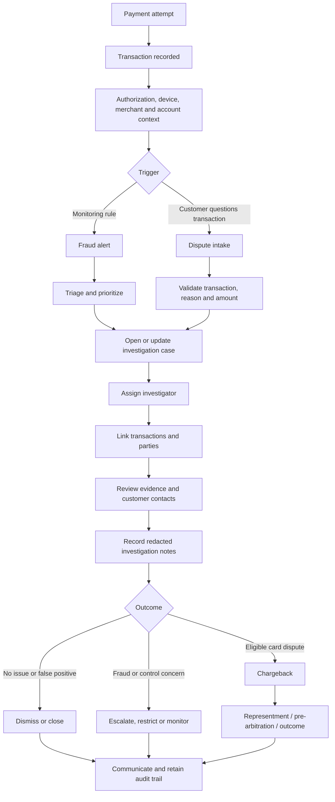
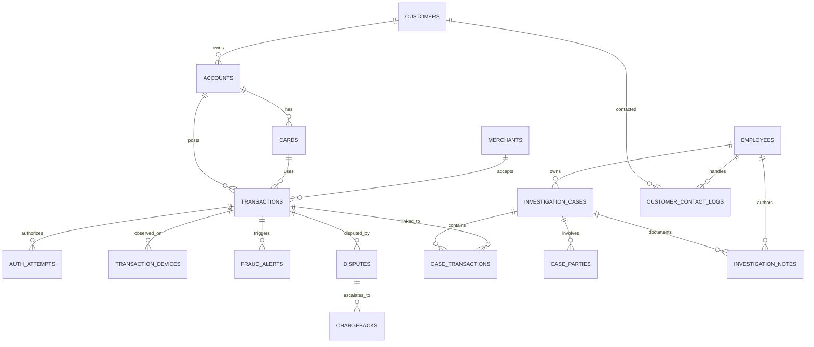

# Transaction Investigation Source Data

This document describes the synthetic source data used by the Transaction
Investigation pipeline. It has two parts:

1. [Mock data source generation and business logic](#part-1-mock-data-source-generation-and-business-logic)
2. [Source-to-Silver data contracts](#part-2-source-to-silver-data-contracts)

The intended audience is a mix of business reviewers, investigators, data
engineers, and data-quality reviewers. The data is synthetic and must not be
used for real customers, production decisions, scheme submissions, regulatory
reporting, or legal conclusions.

## Part 1: Mock data source generation and business logic

### 1. Business context

A transaction investigation brings together the payment event, the customer
and payment instrument, merchant information, authentication and device
evidence, customer contact, alerts, disputes, and the investigator's case
record. Two related processes are represented:

- **Transaction or fraud investigation:** a monitoring alert or other concern is
  triaged, assigned to an investigator, linked to relevant transactions and
  parties, documented, and resolved.
- **Customer dispute and chargeback:** a customer questions a transaction, the
  issuer assesses the claim and available evidence, and an eligible card
  dispute may proceed through the card-scheme chargeback process.

The Australian ePayments Code requires a subscriber to provide a way to report
unauthorised transactions, acknowledge the report, gather relevant information,
investigate it, and explain the outcome. It normally requires an initial
response within 21 days and completion within 45 days unless exceptional
circumstances apply. Card-scheme timeframes can apply when the subscriber uses
scheme rights to resolve a card dispute. These requirements provide business
context; the mock data does not implement or prove these service levels.
See the [ASIC ePayments Code](https://download.asic.gov.au/media/lloeicwb/epayments-code-published-02-june-2022.pdf).

The configured dispute reasons mirror selected Visa conditions: `10.4` for
card-absent fraud, `13.1` for merchandise or services not received, and `13.7`
for cancelled merchandise or services. Visa also describes the use of
transaction records and compelling evidence when responding to disputes. See
[Visa's Dispute Management Guidelines](https://www.visa.com.au/dam/VCOM/global/support-legal/documents/merchants-dispute-management-guidelines.pdf).

The mock chargeback stages borrow industry terms such as representment and
pre-arbitration. In a real scheme process, the issuer, acquirer, and merchant
exchange claims and supporting evidence, and unresolved claims can advance to
pre-arbitration or arbitration under scheme-specific conditions and deadlines.
See the [Mastercard Chargeback Guide](https://www.mastercard.com/content/dam/mccom/shared/business/support/rules-pdfs/chargeback-guide.pdf).

Fraud and AML investigation are not identical to a cardholder dispute.
AUSTRAC's guidance describes a separate process of identifying suspicious
activity, reviewing transaction-monitoring alerts and relevant material,
deciding whether reasonable grounds for suspicion exist, keeping records, and
protecting restricted information from inappropriate disclosure. This informs
the mock's alert, case, note, party, and `legal_hold` concepts; it does not make
the dataset an AML reporting solution. See
[AUSTRAC's suspicious-matter guidance](https://www.austrac.gov.au/industry-and-business/obligations-and-guidance/your-amlctf-program/reporting-us/suspicious-matter-reports).

### 2. End-to-end investigation flow



This is a conceptual business flow, not a sequence generated by the code. The
source tables are snapshot-style records with randomly selected current
statuses; they are not an event log of every state transition.

### 3. How the implemented entities relate



The implemented model deliberately keeps cases and disputes loosely coupled:

- `disputes.transaction_id` links a dispute to a transaction.
- `case_transactions` is the many-to-many bridge between cases and
  transactions.
- There is no `case_id` on `disputes` and no `dispute_id` on
  `investigation_cases`.
- Cases, disputes, chargebacks, and alerts are generated independently. A
  case-linked transaction is therefore not guaranteed to have a dispute,
  chargeback, or alert, and a disputed transaction is not guaranteed to be in a
  case.

This distinction is important when demonstrating joins or investigation
coverage: a relationship that is plausible in the business process must not be
assumed unless a key in the data establishes it.

### 4. Generator entry points and reproducibility

The reusable generator is in `mock/`; `python -m mock.generate` is the local
entry point. `generate_mock_databricks.py` calls the same generator inside
Databricks and publishes numbered batches to a Unity Catalog volume.

| Setting | Default | Behavior |
|---|---:|---|
| Pinned run date | `2026-07-06` | `mock.helpers.run_now()` returns midnight on this date. Past, future, and stale rules are evaluated relative to it, not the computer clock. |
| Faker seed | `42` | Creates an `en_AU` Faker stream for synthetic names, addresses, companies, emails, and IP addresses. |
| Random seed | `43` | The general-purpose RNG uses `seed + 1`, isolating it from Faker. |
| Output | `data/raw` | Local flat output for one snapshot. |
| Customers | `5,000` | Base customer population before added duplicate rows. |
| Transactions | `2,000,000` | Assignment baseline; Databricks' widget defaults to `200,000` for a smaller development batch. |
| Scale | `1.0` | Multiplies configured base volumes before explicit customer or transaction overrides. Negative values are treated as zero. |
| Defect rate | `0.05` | Controls most intentional defects and must be from 0 through 1. |
| Snapshots | `1` | One gives flat files; two or more create `snapshot_T0`, `snapshot_T1`, and later complete extracts. |
| SCD rate | `0.02` | Fraction used when selecting dimension changes; must be from 0 through 1. |
| Stress mode | off | Sets transactions to 2,000,000 only when no explicit transaction count is supplied. |
| Table filter | all | `--tables` accepts a comma-separated subset; dependencies are not added automatically. |

With the same code, arguments, and input state, generated values and selected
defects are deterministic. Sequential IDs use prefixes such as `CUST-`,
`ACC-`, `CARD-`, `TXN-`, `DSP-`, and `CASE-`. Transaction-like IDs use at
least six digits where the generator requests a dynamic width.

### 5. Volumes and generation order

Counts are calculated before generation. Duplicate injection can add physical
rows after these target counts, so a CSV can contain more records than the
nominal count.

| Dataset | Default/derivation | Baseline target |
|---|---:|---:|
| `customers` | configured base | 5,000 |
| `employees` | configured base | 200 |
| `merchants` | configured base | 2,000 |
| `transactions` | configured base | 2,000,000 |
| `accounts` | `max(10, customers × 1.5)` | 7,500 |
| `cards` | `max(10, accounts × 1.2)` | 9,000 |
| `auth_attempts` | `transactions × 1.2` | 2,400,000 |
| `transaction_devices` | `transactions × 0.8` | 1,600,000 |
| `disputes` | `max(1, transactions × 0.02)` | 40,000 |
| `chargebacks` | `disputes × 0.2` | 8,000 |
| `fraud_alerts` | `max(1, transactions × 0.005)` | 10,000 |
| `investigation_cases` | `max(5, transactions × 0.001)` | 2,000 |
| `investigation_notes` | `cases × 5` | 10,000 |
| `case_transactions` | `cases × 3` | 6,000 |
| `case_parties` | `cases × 2` | 4,000 |
| `customer_contact_logs` | `max(1, cases)` | 2,000 |
| Reference tables | fixed configured values | natural lookup size |
| `date_dim` | daily, 2023-01-01 through 2030-12-31 | 2,922 |

Generation follows parent-before-child order:

1. Reference data and calendar
2. Customers and employees
3. Accounts, cards, and merchants
4. Transactions, authorization attempts, and devices
5. Disputes, chargebacks, and fraud alerts
6. Cases, notes, case-transaction links, case parties, and contact logs

The context object retains parent IDs and selected lookup maps so clean child
rows normally have resolvable foreign keys. Supplying `--tables` does not
resolve prerequisites; for example, generating `transactions` without first
generating cards, accounts, and merchants will fail because their context pools
do not exist.

### 6. Normal row-generation logic

| Entity group | Implemented logic |
|---|---|
| Reference data | Uses fixed lists for six merchant categories, four channels, four case statuses, three dispute reasons, four fraud types, five countries, five currencies, and four branches. |
| Calendar | Emits every day in the configured inclusive range. `date_id` is `YYYYMMDD`; year, month, quarter, and weekend flag are derived from the date. |
| Customers | Generates Australian-locale identities aged 18–85. Phone and tax identifiers are synthetic. `created_at` is up to 1,000 days before the pinned date and initially equals `effective_at`. |
| Employees | Generates a name, synthetic `@nab-mock.dev` email, and random team and role. |
| Accounts | Chooses an existing customer; open dates are up to 2,000 days old. Status weights are active 80, dormant 8, closed 8, and frozen 4. Currency is always AUD. |
| Cards | Chooses an existing account and random debit/credit type, synthetic full PAN, expiry month, status, and effective time. Status weights are active 80, blocked 5, expired 5, and closed 10. At least one closed card is forced for transaction testing. |
| Merchants | Chooses a configured MCC and country, a low/medium/high risk rating, and a status weighted active 85, suspended 8, and closed 7. At least one closed merchant is available. |
| Transactions | Chooses a card and uses that card's account as the canonical account, then chooses merchant, channel, amount from 1.00–500.00, currency, timestamp from the prior 30 days, and status. Currency is weighted heavily to AUD; status is weighted heavily to settled. About 2% of rows reference a closed merchant as a realistic state, not a manifest defect. |
| Authorization attempts | References the retained transaction sample. Decisions are weighted 88% approved and 12% declined; only declines receive a decline reason. The clean authorization timestamp equals the known transaction timestamp. |
| Transaction devices | References the transaction sample and generates device type, public IPv4 value, and configured country. |
| Disputes | References the transaction sample, chooses one of the three reason codes, an independent amount, status, and a time from the prior ten days. Where the transaction time is known, `raised_at` is adjusted to be no earlier than it. |
| Chargebacks | References a generated dispute and independently chooses scheme, amount, current stage, and a processed time from the prior 20 days. |
| Fraud alerts | References the transaction sample and chooses one of four illustrative rules, a score from 0.50–0.99, a time from the prior 30 days, and a disposition. |
| Investigation cases | Chooses priority, case status, fraud type, and employee owner. Open times are up to 400 days old. A randomly closed case receives a close time 1–60 days after opening; other cases have no close time. |
| Investigation notes | Chooses a case and employee author, one of three standard note templates, and a created time from the prior 30 days. |
| Case transactions | Generates unique `(case_id, transaction_id)` pairs against the retained transaction sample and assigns a linked time from the prior 30 days. |
| Case parties | Generates unique `(case_id, party_type, party_id)` tuples. Customer and merchant parties resolve to their parent table; third parties receive a synthetic `TP-` ID. |
| Contact logs | Chooses an existing customer and employee, contact direction and method, a time from the prior 30 days, and initially sets `do_not_contact=false` with an empty note. |

Several attributes are intentionally independent for variety. For example, a
dispute or chargeback amount does not have to equal the transaction amount,
chargeback stage is not reconstructed from earlier stage events, alert time is
not ordered against transaction time, and investigation-note time is not
ordered against case opening. These are mock-data simplifications, not business
rules.

### 7. Streaming and transaction sampling

`transactions`, `auth_attempts`, and `transaction_devices` use Python
generators so those large facts can be written without holding every row in
memory. `fraud_alerts` is currently accumulated in a list before it is written,
despite the module-level design comment grouping it with streaming facts. The
transaction generator retains an approximately 200,000-ID downsample, plus
timestamps for those IDs. Downstream disputes, alerts, authorization attempts,
devices, and case links choose from this pool.

For a population larger than 200,000, the retained interval is:

```text
sample_step = max(1, transaction_count // 200,000)
```

The first transaction and then every `sample_step`-th produced base transaction
are retained. Because integer division is used, the pool can be slightly larger
than 200,000 for some counts. Injected duplicate transaction rows are not added
as separate pool entries. This design bounds memory but concentrates child
relationships on the sampled transaction population.

### 8. Intentional data-quality defects

Most defect counts use:

```text
round(population × defect_rate × weight)
```

For a positive population and defect rate, at least `min_count` rows are
selected (normally one). Selection is deterministic and without replacement
within one rule. Selections for different rules may overlap, so one final row
can have multiple manifest entries and a later mutation can overwrite an
earlier value. `defect_rate=0` disables defects that use this formula, but the
employee duplicate is added whenever at least two employees exist.

| Source | Weight / trigger | Injected condition and manifest rule |
|---|---:|---|
| `customers` | 0.5 | Empty email; `DQ-CUST-EMAIL-FMT`. `CUST-0001` is excluded. |
| `customers` | 0.3 | Exact cloned row with duplicate ID; `DQ-CUST-ID-DUP`. Adds rows. |
| `customers` | 0.3 | Same identity attributes under a new ID; `DQ-CUST-NEAR-DUP`. Adds rows. |
| `employees` | whenever `n >= 2` | One added employee clones the first name and email; logs `DQ-EMP-EMAIL-UNIQ` and `DQ-EMP-NAME-NEAR-DUP`. |
| `accounts` | 0.5 | Customer changed to `CUST-9999`; `DQ-ACC-CUST-FK`. |
| `accounts` | 0.3 | Future open date; `DQ-ACC-OPENDATE-FUTURE`. |
| `cards` | 0.4 | Active card with expiry `2024-02`; `DQ-CARD-EXPIRED-ACTIVE`. |
| `cards` | 0.3 | Exact cloned card ID; `DQ-CARD-DUP`. Adds rows. |
| `merchants` | 0.8, minimum 2 | Risk changed to `HIGH`, `High`, `H`, `Low`, or `M`; `DQ-MERCH-RISK-CASING`. |
| `transactions` | 0.4 | Clone of a recent clean row; `DQ-TXN-ID-DUP`. Adds rows. |
| `transactions` | 0.5 | Negative amount; `DQ-TXN-AMT-POS`. |
| `transactions` | 0.4 | Blank merchant ID; `DQ-TXN-MERCH-REQ`. |
| `transactions` | 0.4 | Account/card changed to `ACC-9999`/`CARD-9999`; `DQ-TXN-ACCT-FK`. |
| `transactions` | 0.4 | Future transaction time; `DQ-TXN-TS-FUTURE`. |
| `transactions` | 0.3 | Uses a known closed card and its canonical account; `DQ-TXN-CARD-ACTIVE`. Kept disjoint from orphan-card rows. |
| `auth_attempts` | 0.3 | Transaction changed to `TXN-999999`; `DQ-AUTH-TXN-FK`. |
| `auth_attempts` | 0.3 | Future authorization time; `DQ-AUTH-TS-ORDER`. |
| `transaction_devices` | 0.3 | Transaction changed to `TXN-999999`; `DQ-DEV-TXN-FK`. |
| `transaction_devices` | 0.2 | Blank device type; `DQ-DEV-TYPE-REQ`. |
| `disputes` | 0.5 | Transaction changed to `TXN-999999`; `DQ-DISP-TXN-FK`. |
| `disputes` | 0.4 | Status changed to incorrectly cased `Open`; `DQ-DISP-STATUS-ENUM`. |
| `disputes` | 0.4 | Blank reason code; `DQ-DISP-REASON-REQ`. |
| `chargebacks` | 0.4 | Dispute changed to `DSP-999999`; `DQ-CBK-DISP-FK`. |
| `fraud_alerts` | 0.5 | Score changed to a value from 1.20–5.00; `DQ-ALT-SCORE-RANGE`. |
| `investigation_cases` | 0.2, minimum 1 | `legal_hold=true` and status initially set to suspended; `DQ-CASE-LEGALHOLD` marks the record as restricted from AI output. |
| `investigation_cases` | 0.3 | Status changed to invalid `on_hold`; `DQ-CASE-STATUS-ENUM`. |
| `investigation_cases` | 0.4 | Opened 200–700 days ago and left open; `DQ-CASE-STALE`. |
| `investigation_notes` | 0.5 | Note embeds synthetic name, email, phone, and PAN; `DQ-NOTE-PII-LEAK`. |
| `investigation_notes` | 0.3, minimum 1 when legal-hold cases exist | Note assigned to a legal-hold case; `DQ-NOTE-LEGALHOLD`. |
| `case_transactions` | 0.3 | Transaction changed to `TXN-999999`; `DQ-CASETXN-TXN-FK`. |
| `case_parties` | 0.4, minimum 1 | Customer party given merchant-shaped `MCH-9999`; `DQ-CASEPARTY-RESOLVE`. |
| `case_parties` | 0.2, minimum 1 | Party type changed to `suspect`; `DQ-CASEPARTY-TYPE-ENUM`. |
| `customer_contact_logs` | 0.4, minimum 1 | Outbound contact with `do_not_contact=true`; `DQ-CTL-DNC-VIOLATION`. |
| `customer_contact_logs` | 0.4, minimum 1 | Contact note embeds synthetic PII and PAN; `DQ-CTL-NOTE-PII`. |

The manifest contains one row per injected defect, not necessarily one row per
defective source record:

```text
source_table, record_key, rule_id, rule_name, failure_reason, severity
```

It is the test oracle used to compare expected defects with Silver quarantine
behavior. Legitimate SCD changes are kept in a different manifest. Some natural
random combinations can also violate a downstream business rule; only explicit
injections listed above are guaranteed to appear in `defects_manifest.csv`.

### 9. SCD Type 2 snapshot logic

Local generation with `--snapshots N`, where `N >= 2`, writes complete extracts
under `snapshot_T0` through `snapshot_T(N-1)`. Each later snapshot is copied
from the preceding one, so changes accumulate across batches while unchanged
facts are repeated.

| Dimension | Natural key | Changed attribute | Example business meaning |
|---|---|---|---|
| `customers` | `customer_id` | `address` | Customer moved |
| `cards` | `card_id` | `status` | Card lifecycle change |
| `merchants` | `merchant_id` | `risk_rating` | Merchant risk reassessment |

For each later snapshot:

1. Copy every CSV from the prior snapshot.
2. Read `defects_manifest.csv` and exclude any dimension natural key recorded
   as defective.
3. Select rows with isolated seeds (`seed + 7000 + snapshot_index` for
   selection and `seed + 8000 + snapshot_index` for Faker).
4. Force `CUST-0001` into the customer selection when eligible.
5. Replace the tracked attribute with a different coherent value.
6. Set `effective_at` to the snapshot date.
7. Append the before/after values to `scd_changes_manifest.csv`.

Snapshot dates start at the pinned run date and advance by 30 days. The
selection count is implemented as
`min(max(1, int(row_count × scd_rate)), eligible_count)`. Consequently, even
`scd_rate=0` currently changes one eligible row per non-empty SCD dimension.
This is current code behavior rather than the intuitive meaning of a zero rate.

`scd_changes_manifest.csv` is a cumulative oracle with:

```text
source_table, natural_key, snapshot, changed_attribute, old_value, new_value,
prior_effective_at, effective_at
```

An individual snapshot file contains the current version of each row, not both
old and new versions. Bronze appends files from multiple snapshots; Silver uses
the natural key, `effective_at`, and record hash to interpret history and
unchanged re-extracts.

### 10. Databricks batch generation and publication

`generate_mock_databricks.py` uses these widgets:

| Widget | Default |
|---|---|
| `catalog` | `g3_dev` (`g3_dev`, `g3_test`, or `g3_catalog`) |
| `transactions` | `200000` |
| `seed` | `42` |
| `defect_rate` | `0.05` |
| `scd_rate` | `0.02` |

The notebook creates `<catalog>.bronze` and the `raw_data` volume, then writes
to `/Volumes/<catalog>/bronze/raw_data`. A run uses one batch number across all
tables. It scans existing non-staging table folders, recognizes names such as
`customer01.csv`, and chooses one more than the highest detected number.

The publication flow is:


On batch 1, the notebook calls `mock.generate.main()` with transactions, seed,
defect rate, and one flat snapshot. On later batches, it restores every prior
source CSV and `defects_manifest`, reads the prior SCD oracle, and derives a new
complete snapshot. Therefore, changing the `transactions` or `defect_rate`
widget after batch 1 does not regenerate later batches; those widget values are
effectively ignored for later data derivation. The seed and SCD rate still
control SCD selection and replacement values.

Before publication, `repair_transaction_account_links()` treats the card as the
canonical account owner. For each known card it corrects a mismatched
`transactions.account_id`. Unknown cards are left untouched as intentional DQ
fixtures. It then removes stale `DQ-TXN-ACCT-FK` manifest entries for
transactions whose card now resolves.

Files are first generated successfully in staging. The notebook refuses to
overwrite an existing target, then moves staged CSVs to:

```text
/Volumes/<catalog>/bronze/raw_data/<table>/<singular-table-name><NN>.csv
```

Examples are `customers/customer01.csv`,
`transactions/transaction01.csv`, and
`defects_manifest/defects_manifest01.csv`. Staging prevents partially generated
source files from being published. Publication is a sequence of file moves,
not a multi-file transactional commit, so an infrastructure failure during the
move loop could still leave a partially published batch.

Finally, the notebook lists table folders, counts manifest defects by table and
rule, displays samples, and, from batch 2 onward, shows the `CUST-0001` address
history as an SCD demonstration.

### 11. Important limitations

- The data is synthetic and represents no real customer or institution.
- Random status values are current-state examples, not valid transition
  histories.
- The model does not represent provisional credits, recovery accounting,
  merchant evidence documents, issuer/acquirer messages, scheme deadlines, or
  customer liability decisions.
- Dispute amounts, chargeback amounts, and transaction amounts are generated
  independently.
- Cases and disputes do not have a direct key relationship.
- Fraud alerts are not guaranteed to create cases despite the
  `escalated_to_case` disposition value.
- `legal_hold` is a project-level restriction flag, not a complete legal-hold
  workflow.
- Generated PANs, names, addresses, emails, phones, tax identifiers, and IP
  addresses are synthetic but are deliberately treated as sensitive so that
  masking and redaction controls can be tested.
- The business references in this document explain the use case; they do not
  certify that the mock process complies with regulation or card-scheme rules.

## Part 2: Source-to-Silver data contracts

### 12. How to read the contracts

There is one YAML contract per generated domain CSV under
`docs/contracts/sources`. `mock.config.TABLE_SCHEMAS` is the source of truth for
physical CSV column order, and the YAML files define the Source-to-Silver
contract. Raw values land in Bronze as strings. Silver performs type coercion,
validation, masking, and quarantine routing.

All contracts below have schema version `1.0.0`, layer `source_to_silver`,
contractual type layer `silver`, default failure disposition `quarantined`, and
failure destination `silver.quarantine_records`.

Conventions:

- **PK** is taken from the YAML `primary_key`.
- **FK** is shown only when the YAML field declares `references`.
- **—** means the YAML does not declare a reference, accepted-value list, or DQ
  rule for that field.
- Examples and even awkward grain wording are reproduced from the YAML rather
  than silently corrected here.
- Classification describes sensitivity and handling, not a data type.

### 13. Contract index

| Business area | Contracts |
|---|---|
| Customer and payment instrument | [customers](#customers), [accounts](#accounts), [cards](#cards) |
| Merchant and reference | [merchants](#merchants), [merchant_categories](#merchant_categories), [countries](#countries), [currencies](#currencies), [channels](#channels), [branches](#branches), [date_dim](#date_dim) |
| Transaction evidence | [transactions](#transactions), [auth_attempts](#auth_attempts), [transaction_devices](#transaction_devices) |
| Dispute and chargeback | [disputes](#disputes), [dispute_reason_codes](#dispute_reason_codes), [chargebacks](#chargebacks) |
| Investigation | [fraud_alerts](#fraud_alerts), [fraud_types](#fraud_types), [investigation_cases](#investigation_cases), [case_status_types](#case_status_types), [employees](#employees), [investigation_notes](#investigation_notes), [case_transactions](#case_transactions), [case_parties](#case_parties), [customer_contact_logs](#customer_contact_logs) |

### customers

Source: `data/raw/customers.csv`  
Purpose: Mock source dataset for customers.  
Grain: one row per customer  
Primary key: `customer_id`

| Field | Type | Required | Key / reference | Accepted values | Classification | DQ rules | Example |
|---|---|---:|---|---|---|---|---|
| `customer_id` | string | yes | PK | — | internal | `DQ-CUST-ID-DUP`, `DQ-CUST-NEAR-DUP` | `CUST-0001` |
| `first_name` | string | yes | — | — | direct_identifier | — | `example` |
| `last_name` | string | yes | — | — | direct_identifier | — | `example` |
| `dob` | date | yes | — | — | sensitive | `DQ-CUST-DOB-TYPE` | `2026-07-06` |
| `email` | string | no | — | — | contact | `DQ-CUST-EMAIL-FMT` | `example` |
| `phone` | string | no | — | — | contact | — | `example` |
| `address` | string | no | — | — | sensitive | — | `example` |
| `tax_id` | string | no | — | — | sensitive | — | `example` |
| `created_at` | timestamp | yes | — | — | internal | `DQ-CUST-CREATED-TYPE` | `2026-07-06T10:00:00Z` |
| `effective_at` | timestamp | yes | — | — | internal | — | `2026-07-06T10:00:00Z` |

### accounts

Source: `data/raw/accounts.csv`  
Purpose: Mock source dataset for accounts.  
Grain: one row per account  
Primary key: `account_id`

| Field | Type | Required | Key / reference | Accepted values | Classification | DQ rules | Example |
|---|---|---:|---|---|---|---|---|
| `account_id` | string | yes | PK | — | internal | — | `ACC-0001` |
| `customer_id` | string | yes | FK → `customers.customer_id` | — | internal | `DQ-ACC-CUST-FK` | `CUST-0001` |
| `product_type` | string | yes | — | `Everyday`, `Savings`, `Credit`, `Debit` | internal | — | `Everyday` |
| `open_date` | date | yes | — | — | internal | `DQ-ACC-OPENDATE-FUTURE`, `DQ-ACC-OPENDATE-TYPE` | `2026-07-06` |
| `status` | string | yes | — | `active`, `dormant`, `closed`, `frozen` | internal | — | `active` |
| `currency` | string | yes | — | — | internal | — | `example` |

### cards

Source: `data/raw/cards.csv`  
Purpose: Mock source dataset for cards.  
Grain: one row per card  
Primary key: `card_id`

| Field | Type | Required | Key / reference | Accepted values | Classification | DQ rules | Example |
|---|---|---:|---|---|---|---|---|
| `card_id` | string | yes | PK | — | internal | `DQ-CARD-DUP` | `CARD-0001` |
| `account_id` | string | yes | FK → `accounts.account_id` | — | internal | `DQ-CARD-ACCT-FK` | `ACC-0001` |
| `card_type` | string | yes | — | `debit`, `credit` | internal | — | `debit` |
| `pan` | string | yes | — | — | payment_card | — | `example` |
| `expiry` | string | yes | — | — | internal | `DQ-CARD-EXPIRED-ACTIVE` | `example` |
| `status` | string | yes | — | `active`, `blocked`, `expired`, `closed` | internal | — | `active` |
| `effective_at` | timestamp | yes | — | — | internal | — | `2026-07-06T10:00:00Z` |

### merchants

Source: `data/raw/merchants.csv`  
Purpose: Mock source dataset for merchants.  
Grain: one row per merchant  
Primary key: `merchant_id`

| Field | Type | Required | Key / reference | Accepted values | Classification | DQ rules | Example |
|---|---|---:|---|---|---|---|---|
| `merchant_id` | string | yes | PK | — | internal | — | `MCH-0001` |
| `name` | string | yes | — | — | internal | — | `example` |
| `mcc` | string | yes | FK → `merchant_categories.mcc` | — | internal | — | `example` |
| `country` | string | yes | FK → `countries.iso_code` | — | internal | — | `example` |
| `risk_rating` | string | yes | — | `low`, `medium`, `high` | internal | `DQ-MERCH-RISK-CASING` | `low` |
| `status` | string | yes | — | `active`, `suspended`, `closed` | internal | — | `active` |
| `effective_at` | timestamp | yes | — | — | internal | `DQ-MERCH-EFFECTIVE-TYPE` | `2026-07-06T10:00:00Z` |

### merchant_categories

Source: `data/raw/merchant_categories.csv`  
Purpose: Mock source dataset for merchant categories.  
Grain: one row per merchant_categorie  
Primary key: `mcc`

| Field | Type | Required | Key / reference | Accepted values | Classification | DQ rules | Example |
|---|---|---:|---|---|---|---|---|
| `mcc` | string | yes | PK | — | internal | — | `example` |
| `category_name` | string | yes | — | — | internal | — | `example` |
| `category_group` | string | yes | — | — | internal | — | `example` |

### countries

Source: `data/raw/countries.csv`  
Purpose: Mock source dataset for countries.  
Grain: one row per countrie  
Primary key: `iso_code`

| Field | Type | Required | Key / reference | Accepted values | Classification | DQ rules | Example |
|---|---|---:|---|---|---|---|---|
| `iso_code` | string | yes | PK | — | internal | — | `example` |
| `name` | string | yes | — | — | internal | — | `example` |
| `region` | string | yes | — | — | internal | — | `example` |

### currencies

Source: `data/raw/currencies.csv`  
Purpose: Mock source dataset for currencies.  
Grain: one row per currencie  
Primary key: `currency_code`

| Field | Type | Required | Key / reference | Accepted values | Classification | DQ rules | Example |
|---|---|---:|---|---|---|---|---|
| `currency_code` | string | yes | PK | — | internal | — | `example` |
| `name` | string | yes | — | — | internal | — | `example` |
| `decimals` | integer | yes | — | — | internal | `DQ-CURR-DECIMALS-TYPE` | `2` |

### channels

Source: `data/raw/channels.csv`  
Purpose: Mock source dataset for channels.  
Grain: one row per channel  
Primary key: `channel_code`

| Field | Type | Required | Key / reference | Accepted values | Classification | DQ rules | Example |
|---|---|---:|---|---|---|---|---|
| `channel_code` | string | yes | PK | — | internal | — | `example` |
| `channel_name` | string | yes | — | — | internal | — | `example` |

### branches

Source: `data/raw/branches.csv`  
Purpose: Mock source dataset for branches.  
Grain: one row per branche  
Primary key: `branch_code`

| Field | Type | Required | Key / reference | Accepted values | Classification | DQ rules | Example |
|---|---|---:|---|---|---|---|---|
| `branch_code` | string | yes | PK | — | internal | — | `BR-01` |
| `name` | string | yes | — | — | internal | — | `example` |
| `country` | string | yes | FK → `countries.iso_code` | — | internal | — | `example` |
| `region` | string | yes | — | — | internal | — | `example` |
| `status` | string | yes | — | — | internal | — | `example` |

### date_dim

Source: `data/raw/date_dim.csv`  
Purpose: Mock source dataset for date dim.  
Grain: one row per calendar day  
Primary key: `date_id`

| Field | Type | Required | Key / reference | Accepted values | Classification | DQ rules | Example |
|---|---|---:|---|---|---|---|---|
| `date_id` | date | yes | PK | — | internal | `DQ-DATE-ID-TYPE` | `20260706` |
| `year` | integer | yes | — | — | internal | `DQ-DATE-YEAR-TYPE` | `2` |
| `month` | integer | yes | — | — | internal | `DQ-DATE-MONTH-TYPE` | `2` |
| `quarter` | integer | yes | — | — | internal | `DQ-DATE-QUARTER-TYPE` | `2` |
| `is_weekend` | boolean | yes | — | — | internal | `DQ-DATE-WEEKEND-TYPE` | `true` |

### transactions

Source: `data/raw/transactions.csv`  
Purpose: Mock source dataset for transactions.  
Grain: one row per transaction  
Primary key: `transaction_id`

| Field | Type | Required | Key / reference | Accepted values | Classification | DQ rules | Example |
|---|---|---:|---|---|---|---|---|
| `transaction_id` | string | yes | PK | — | internal | `DQ-TXN-ID-DUP` | `TXN-000001` |
| `account_id` | string | yes | FK → `accounts.account_id` | — | internal | `DQ-TXN-ACCT-FK` | `ACC-0001` |
| `card_id` | string | yes | FK → `cards.card_id` | — | internal | `DQ-TXN-CARD-ACTIVE`, `DQ-TXN-CARD-FK` | `CARD-0001` |
| `merchant_id` | string | yes | FK → `merchants.merchant_id` | — | internal | `DQ-TXN-MERCH-REQ`, `DQ-TXN-MERCH-FK` | `MCH-0001` |
| `channel` | string | yes | FK → `channels.channel_code` | — | internal | — | `example` |
| `amount` | decimal(18,2) | yes | — | — | internal | `DQ-TXN-AMT-POS`, `DQ-TXN-AMOUNT-TYPE` | `100.00` |
| `currency` | string | yes | FK → `currencies.currency_code` | — | internal | — | `example` |
| `txn_ts` | timestamp | yes | — | — | internal | `DQ-TXN-TS-FUTURE`, `DQ-TXN-TS-TYPE` | `2026-07-06T10:00:00Z` |
| `status` | string | yes | — | `authorized`, `settled`, `declined`, `reversed`, `refunded` | internal | — | `authorized` |

### auth_attempts

Source: `data/raw/auth_attempts.csv`  
Purpose: Mock source dataset for auth attempts.  
Grain: one row per auth_attempt  
Primary key: `attempt_id`

| Field | Type | Required | Key / reference | Accepted values | Classification | DQ rules | Example |
|---|---|---:|---|---|---|---|---|
| `attempt_id` | string | yes | PK | — | internal | — | `AUTH-000001` |
| `transaction_id` | string | yes | FK → `transactions.transaction_id` | — | internal | `DQ-AUTH-TXN-FK` | `TXN-000001` |
| `decision` | string | yes | — | `approved`, `declined` | internal | — | `approved` |
| `decline_reason` | string | no | — | — | internal | — | `example` |
| `auth_ts` | string | yes | — | — | internal | `DQ-AUTH-TS-ORDER`, `DQ-AUTH-TS-TYPE` | `example` |

### transaction_devices

Source: `data/raw/transaction_devices.csv`  
Purpose: Mock source dataset for transaction devices.  
Grain: one row per transaction_device  
Primary key: `device_id`

| Field | Type | Required | Key / reference | Accepted values | Classification | DQ rules | Example |
|---|---|---:|---|---|---|---|---|
| `device_id` | string | yes | PK | — | device_identifier | — | `DEV-000001` |
| `transaction_id` | string | yes | FK → `transactions.transaction_id` | — | internal | `DQ-DEV-TXN-FK` | `TXN-000001` |
| `device_type` | string | yes | — | — | internal | `DQ-DEV-TYPE-REQ` | `example` |
| `ip` | string | yes | — | — | network_identifier | — | `example` |
| `geo_country` | string | yes | FK → `countries.iso_code` | — | internal | — | `example` |

### disputes

Source: `data/raw/disputes.csv`  
Purpose: Mock source dataset for disputes.  
Grain: one row per dispute  
Primary key: `dispute_id`

| Field | Type | Required | Key / reference | Accepted values | Classification | DQ rules | Example |
|---|---|---:|---|---|---|---|---|
| `dispute_id` | string | yes | PK | — | internal | — | `DSP-0001` |
| `transaction_id` | string | yes | FK → `transactions.transaction_id` | — | internal | `DQ-DISP-TXN-FK` | `TXN-000001` |
| `reason_code` | string | yes | FK → `dispute_reason_codes.reason_code` | — | internal | `DQ-DISP-REASON-REQ` | `example` |
| `amount` | decimal(18,2) | yes | — | — | internal | `DQ-DISP-AMOUNT-TYPE` | `100.00` |
| `status` | string | yes | — | `open`, `in_review`, `resolved`, `rejected`, `withdrawn` | internal | `DQ-DISP-STATUS-ENUM` | `open` |
| `raised_at` | timestamp | yes | — | — | internal | `DQ-DISP-RAISED-TYPE` | `2026-07-06T10:00:00Z` |

### dispute_reason_codes

Source: `data/raw/dispute_reason_codes.csv`  
Purpose: Mock source dataset for dispute reason codes.  
Grain: one row per dispute_reason_code  
Primary key: `reason_code`

| Field | Type | Required | Key / reference | Accepted values | Classification | DQ rules | Example |
|---|---|---:|---|---|---|---|---|
| `reason_code` | string | yes | PK | — | internal | — | `example` |
| `description` | string | yes | — | — | internal | — | `example` |

### chargebacks

Source: `data/raw/chargebacks.csv`  
Purpose: Mock source dataset for chargebacks.  
Grain: one row per chargeback  
Primary key: `chargeback_id`

| Field | Type | Required | Key / reference | Accepted values | Classification | DQ rules | Example |
|---|---|---:|---|---|---|---|---|
| `chargeback_id` | string | yes | PK | — | internal | — | `CBK-0001` |
| `dispute_id` | string | yes | FK → `disputes.dispute_id` | — | internal | `DQ-CBK-DISP-FK` | `DSP-0001` |
| `scheme` | string | yes | — | — | internal | — | `example` |
| `amount` | decimal(18,2) | yes | — | — | internal | `DQ-CBK-AMOUNT-TYPE` | `100.00` |
| `stage` | string | yes | — | — | internal | — | `example` |
| `processed_at` | timestamp | yes | — | — | internal | `DQ-CBK-PROCESSED-TYPE` | `2026-07-06T10:00:00Z` |

### fraud_alerts

Source: `data/raw/fraud_alerts.csv`  
Purpose: Mock source dataset for fraud alerts.  
Grain: one row per fraud_alert  
Primary key: `alert_id`

| Field | Type | Required | Key / reference | Accepted values | Classification | DQ rules | Example |
|---|---|---:|---|---|---|---|---|
| `alert_id` | string | yes | PK | — | internal | — | `ALT-0001` |
| `transaction_id` | string | yes | FK → `transactions.transaction_id` | — | internal | `DQ-ALT-TXN-FK` | `TXN-000001` |
| `rule_name` | string | yes | — | — | internal | — | `example` |
| `score` | double | yes | — | — | internal | `DQ-ALT-SCORE-RANGE`, `DQ-ALT-SCORE-TYPE` | `0.85` |
| `triggered_at` | timestamp | yes | — | — | internal | `DQ-ALT-TRIGGERED-TYPE` | `2026-07-06T10:00:00Z` |
| `disposition` | string | yes | — | `open`, `escalated_to_case`, `dismissed`, `true_positive`, `false_positive` | internal | — | `open` |

### fraud_types

Source: `data/raw/fraud_types.csv`  
Purpose: Mock source dataset for fraud types.  
Grain: one row per fraud_type  
Primary key: `fraud_type_code`

| Field | Type | Required | Key / reference | Accepted values | Classification | DQ rules | Example |
|---|---|---:|---|---|---|---|---|
| `fraud_type_code` | string | yes | PK | — | internal | — | `example` |
| `description` | string | yes | — | — | internal | — | `example` |
| `severity` | string | yes | — | — | internal | — | `example` |

### investigation_cases

Source: `data/raw/investigation_cases.csv`  
Purpose: Mock source dataset for investigation cases.  
Grain: one row per investigation_case  
Primary key: `case_id`

| Field | Type | Required | Key / reference | Accepted values | Classification | DQ rules | Example |
|---|---|---:|---|---|---|---|---|
| `case_id` | string | yes | PK | — | internal | — | `CASE-0001` |
| `priority` | string | yes | — | `low`, `medium`, `high`, `critical` | internal | — | `low` |
| `status_code` | string | yes | FK → `case_status_types.status_code` | — | internal | `DQ-CASE-STATUS-ENUM` | `example` |
| `fraud_type_code` | string | yes | FK → `fraud_types.fraud_type_code` | — | internal | — | `example` |
| `owner_employee_id` | string | yes | FK → `employees.employee_id` | — | internal | — | `example` |
| `opened_at` | timestamp | yes | — | — | internal | `DQ-CASE-STALE`, `DQ-CASE-OPENED-TYPE` | `2026-07-06T10:00:00Z` |
| `closed_at` | timestamp | no | — | — | internal | `DQ-CASE-CLOSED-TYPE` | `2026-07-06T10:00:00Z` |
| `legal_hold` | boolean | yes | — | — | restricted | `DQ-CASE-LEGALHOLD`, `DQ-CASE-LEGALHOLD-TYPE` | `true` |

### case_status_types

Source: `data/raw/case_status_types.csv`  
Purpose: Mock source dataset for case status types.  
Grain: one row per case_status_type  
Primary key: `status_code`

| Field | Type | Required | Key / reference | Accepted values | Classification | DQ rules | Example |
|---|---|---:|---|---|---|---|---|
| `status_code` | string | yes | PK | — | internal | — | `example` |
| `description` | string | yes | — | — | internal | — | `example` |

### employees

Source: `data/raw/employees.csv`  
Purpose: Mock source dataset for employees.  
Grain: one row per employee  
Primary key: `employee_id`

| Field | Type | Required | Key / reference | Accepted values | Classification | DQ rules | Example |
|---|---|---:|---|---|---|---|---|
| `employee_id` | string | yes | PK | — | internal | — | `EMP-0001` |
| `full_name` | string | yes | — | — | staff_identifier | — | `example` |
| `email` | string | yes | — | — | staff_identifier | — | `example` |
| `team` | string | yes | — | — | internal | — | `example` |
| `role` | string | yes | — | — | internal | — | `example` |

### investigation_notes

Source: `data/raw/investigation_notes.csv`  
Purpose: Mock source dataset for investigation notes.  
Grain: one row per investigation_note  
Primary key: `note_id`

| Field | Type | Required | Key / reference | Accepted values | Classification | DQ rules | Example |
|---|---|---:|---|---|---|---|---|
| `note_id` | string | yes | PK | — | internal | — | `NOTE-0001` |
| `case_id` | string | yes | FK → `investigation_cases.case_id` | — | internal | `DQ-NOTE-CASE-FK` | `CASE-0001` |
| `author_employee_id` | string | yes | FK → `employees.employee_id` | — | internal | `DQ-NOTE-EMP-FK` | `example` |
| `note_text` | string | yes | — | — | sensitive_free_text | `DQ-NOTE-PII-LEAK` | `example` |
| `created_at` | timestamp | yes | — | — | internal | `DQ-NOTE-CREATED-TYPE` | `2026-07-06T10:00:00Z` |

### case_transactions

Source: `data/raw/case_transactions.csv`  
Purpose: Mock source dataset for case transactions.  
Grain: one row per case-to-transaction link  
Primary key: `case_id`, `transaction_id`

| Field | Type | Required | Key / reference | Accepted values | Classification | DQ rules | Example |
|---|---|---:|---|---|---|---|---|
| `case_id` | string | yes | PK; FK → `investigation_cases.case_id` | — | internal | `DQ-CASETXN-CASE-FK` | `CASE-0001` |
| `transaction_id` | string | yes | PK; FK → `transactions.transaction_id` | — | internal | `DQ-CASETXN-TXN-FK` | `TXN-000001` |
| `linked_at` | timestamp | yes | — | — | internal | `DQ-CASETXN-LINKED-TYPE` | `2026-07-06T10:00:00Z` |

### case_parties

Source: `data/raw/case_parties.csv`  
Purpose: Mock source dataset for case parties.  
Grain: one row per case-to-party link  
Primary key: `case_id`, `party_type`, `party_id`

| Field | Type | Required | Key / reference | Accepted values | Classification | DQ rules | Example |
|---|---|---:|---|---|---|---|---|
| `case_id` | string | yes | PK; FK → `investigation_cases.case_id` | — | internal | `DQ-CASEPARTY-CASE-FK` | `CASE-0001` |
| `party_type` | string | yes | PK | `customer`, `merchant`, `third_party` | internal | `DQ-CASEPARTY-TYPE-ENUM` | `customer` |
| `party_id` | string | yes | PK | — | internal | `DQ-CASEPARTY-RESOLVE` | `example` |
| `role` | string | yes | — | `subject`, `reporter`, `witness`, `merchant` | internal | — | `subject` |

`party_id` has a conditional relationship implemented by the DQ rule rather
than a single YAML `references` value: customer IDs resolve to `customers`,
merchant IDs resolve to `merchants`, and third-party IDs are synthetic.

### customer_contact_logs

Source: `data/raw/customer_contact_logs.csv`  
Purpose: Mock source dataset for customer contact logs.  
Grain: one row per customer_contact_log  
Primary key: `contact_id`

| Field | Type | Required | Key / reference | Accepted values | Classification | DQ rules | Example |
|---|---|---:|---|---|---|---|---|
| `contact_id` | string | yes | PK | — | internal | — | `CTL-0001` |
| `customer_id` | string | yes | FK → `customers.customer_id` | — | internal | `DQ-CTL-CUST-FK` | `CUST-0001` |
| `direction` | string | yes | — | `inbound`, `outbound` | internal | — | `inbound` |
| `contact_method` | string | yes | — | `phone`, `email`, `sms`, `post` | internal | — | `phone` |
| `do_not_contact` | boolean | yes | — | — | internal | `DQ-CTL-DNC-TYPE`, `DQ-CTL-DNC-VIOLATION` | `true` |
| `contacted_at` | timestamp | yes | — | — | internal | `DQ-CTL-CONTACTED-TYPE` | `2026-07-06T10:00:00Z` |
| `employee_id` | string | yes | FK → `employees.employee_id` | — | internal | `DQ-CTL-EMP-FK` | `EMP-0001` |
| `note` | string | yes | — | — | sensitive_free_text | `DQ-CTL-NOTE-PII` | `example` |

### 14. Contract ownership and validation

The contract tables above are a human-readable view; the YAML files remain the
machine-readable source of truth. Contract drift is checked with:

```powershell
python -m unittest tests.test_source_contracts
```

That test verifies:

- every table in `mock.config.TABLE_SCHEMAS` has exactly one YAML contract;
- the dataset and source path match the filename;
- grain and primary key are present;
- fields appear in the physical CSV-header order; and
- every declared DQ rule exists in the executable DQ registry.

Gold and AI-output contracts are separately versioned under
`docs/models/gold`; they are outside this source-contract scope.
